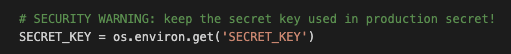
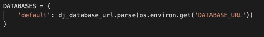
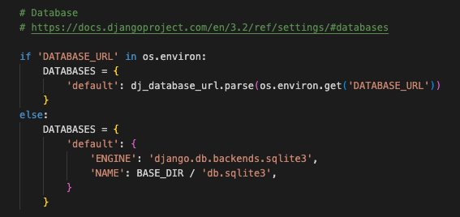
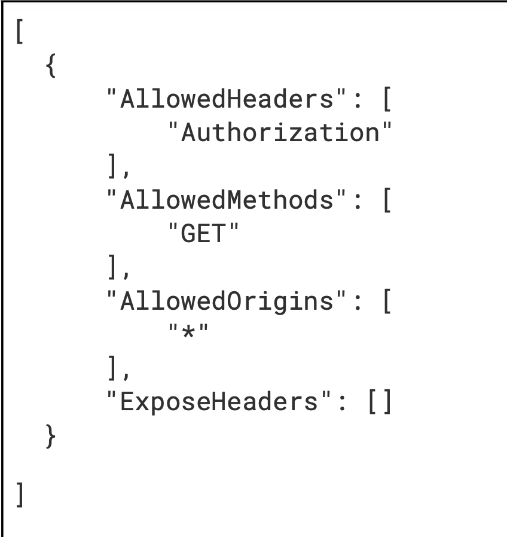

# Saguaro Bags

The live project can be viewed [here](). 

## UX (User Experience) 
### User Stories
* 1: 
* 2: 
* 3:
* 4: 
* 5:
* 6:
* 7:
* 8: 
* 9: 
* 10: 
* 11:
* 12: 
* 13: 
* 14: 
* 15:
* 16:
* 17:
* 18:
* 19:
* 20:
* 21:

## Features
### Existing Features
* Navigation Bar

* 

* User Authentication

* 

* 

### Further Feature Ideas
* 

## Wireframes
I used [Balsamiq](https://www.balsamiq.com) to create Wireframe mock-ups for laptop/large monitor, tablet and mobile devices. 

*  [Wireframe]()

## Design

### Page Designs

### Fonts

I used [Google Fonts](https://fonts.google.com/) for the website fonts. The selected fonts and their fallbacks, should they not import into the site correctly, are as follows:

Selected Font | Fallback Font
------------- | --------------

### Colours

The colour scheme used on the site is as follows: 

Colour Name | Hexadecimal Code
------------| ---------

### Entity Relationship Diagram

The entity relationship diagram for the project can be found [here]().

## Agile Methodology

## Search Engine Optimisation (SEO)

* Initial list of short-tail keywords:

    * Vegan leather
    * Vegan leather bags
    * Cactus leather
    * Cactus leather bags
    * Eco leather 
    * Eco leather bags
    * Sustainable bags

* Additional keywords found by Google searching the initial list:

    * Keyword Searched: Vegan leather 
        * Vegan leather made from plants
        * Vegan leather bags
        * Vegan leather handbags
        * Vegan leather made from
    
    * Keyword Searched: Vegan leather bags
        * Affordable vegan handbags uk
        * Vegan leather handbags uk
        * Vegan leather bags uk
        * Vegan leather bags cactus
        * Vegan leather bags designer

    * Keyword Searched: Cactus leather
        * Where to buy cactus leather
        * Cactus leather uk
        * Cactus leather fabric
        * Is cactus leather biodegradable
        * Desserto cactus leather
        * Cactus leather manufacturers

    * Keyword Searched: Cactus leather bags
        * Vegan cactus bags
        * Handbags made from cactus
        * Cactus leather weekend bag
        * Where to buy cactus leather

    * Keyword Searched: Eco leather
        * Eco leather vs real leather
        * Eco leather vs faux leather
        * Does eco leather last

    * Keyword Searched: Eco leather bags
        * Sustainable bags uk
        * Sustainable bags
        * Sustainable handbag brands
        * Sustainable tote bags

    * Keyword Searched: Sustainable bags
        * Sustainable bags uk
        * Sustainable bag brands

    * Keyword Searched: Sustainable handbags
        * Sustainable handbags uk
        * Sustainable bag brands
        * Sustainable leather bags
        * Vegan sustainable handbags 

* Considering relevance
    * List of keywords narrowed down to exclude the following:
        * The website probably doesn't meet the need behind the following keyword searches as they appear to be more to do with people wanting to buy the cactus leather itself, possible for manufacturing their own products:
            * Where to buy cactus leather
            * Cactus leather fabric
            * Cactus leather manufacturers
        * While the website does mention that cactus leather is partially biodegradable, the site's purpose does not include a detailed account of the properties of cactus leather:
            * Is cactus leather biodegradable
            * Does eco leather last
        * As the site offers a variety of bags, it is perhaps not that helpful to use keywords for specific bag types:
            * Cactus leather weekend bag
            * Sustainable tote bags
        * These keywords are going to be too generic:
            * Vegan leather made from plants
            * Cactus leather uk
            * Vegan leather made from
            * Eco leather vs real leather
            * Eco leather vs faux leather
            * Sustainable bags uk
            * Sustainable bags
            * Sustainable handbag brands
            * Sustainable bags uk
            * Sustainable bag brands
            * Sustainable handbags uk
            * Sustainable bag brands
            
    * Desserto cactus leather has been left in as a relevant keywords because the home page specifically mentions them as a cactus leather manufacturer and includes a link to their website.

* Considering authority
    * Saguaro bags can speak from a place of authority about the following keywords as it is a store selling vegan cactus leather designer bags at an affordable price:
        * Vegan leather bags
        * Vegan leather handbags
        * Affordable vegan handbags uk
        * Vegan leather handbags uk
        * Vegan leather bags uk
        * Vegan leather bags cactus
        * Vegan leather bags designer        
        * Vegan cactus bags
        * Handbags made from cactus
        * Sustainable leather bags
        * Vegan sustainable handbags 
    * Also, being as the site includes information about Desserto's cactus leather and a link to their home page, it can also speak from a place of authority about Desserto:
        * Desserto cactus leather
        
* Considering volume
    * Using the [Wordtracker](https://www.wordtracker.com/) website for searching a number of the above keywords, the following helpful results were found where the balance between a high volume of searches and a reasonable volume of competition was good:

        Keyword | Volume | Competition
        ------------| --------- | ---------
        Vegan designer bags | 1,650 | 5.63
        Cactus leather bag | 383 | -
        Cactus leather handbags | 114 | -
        Desserto leather | 619 | -

* The final keywords list chosen is:
    * Vegan leather bags
    * Vegan designer bags
    * Affordable vegan handbags uk
    * Vegan leather bags cactus
    * Cactus leather bag
    * Cactus leather handbags
    * Desserto cactus leather
    * Desserto leather
    * Sustainable leather bags
              
* The keywords were implemented in the site as follows:
    * Putting h1 and h2 tags in the overlay to the home page hero image and using keywords within these tags.
    * Using keywords in the home page information section headings and in strong tags within the information paragraphs themselves.
    * Adding an external link to the home page to a Guardian article on living more sustainably.
    * Including a footer link to a vegan charity and using the word vegan in the link text and aria-label.
    * Including a link to Desserto's homepage, a leading manufacturer of cactus leather who rank well in keyword searches.
    * Including all the keywords in the meta keywords tag content attribute.
    * All of the alt attributes for the 50 bags being sold on the site include the words 'cactus leather'.

* Ideally I would have liked to refer to Desserto as a partner on the home page, but being as the site is not a real e-commerce site and has not partnered with Desserto, I have refrained from doing this. However, were this a real site that had partnered with Desserto, then I would include further references to them to improve the SEO.
    
## Technologies Used

### Languages 
* [HTML5](https://en.wikipedia.org/wiki/HTML5) programming language for the structure and content of the website.
* [CSS3](https://en.wikipedia.org/wiki/CSS) for styling the look of the website.
* [JavaScript](https://en.wikipedia.org/wiki/JavaScript) for adding interactivity to the website. 
* [Python](https://en.wikipedia.org/wiki/Python_(programming_language)) programming language for the logic of the application.

### Frameworks, Libraries and Modules
* [Django](https://www.djangoproject.com/) was the python framework used to allow rapid, secure development and the clean, pragmatic design of this application.
* [Bootstrap](https://getbootstrap.com/) was the framework used to assist in the building of a responsive, mobile-first site.
* [Gunicorn](https://gunicorn.org/) was used as the python WSGI HTTP Server to run Django on Heroku.
* [dj_database_url](https://pypi.org/project/dj-database-url/) was used so that database URLs could be used in the Django Application to connect to the Postgres database.
* [psycopg2](https://pypi.org/project/psycopg2/) was the PostgreSQL database adapter used for the Python programming language.
* [django-allauth](https://django-allauth.readthedocs.io/en/latest/installation.html) was used for authentication, registration and account management for the application.
* [django-crispy-forms](https://django-crispy-forms.readthedocs.io/en/latest/) was used to help manage the formatting of forms in the django application.
* [django-countries](https://pypi.org/project/django-countries/) was used to provide a CountryField for the Order and UserProfile models. 
* [Pillow](https://pypi.org/project/Pillow/) Python Imaging Library was used to add image processing capabilities to the Python interpreter.
* [Stripe python library](https://pypi.org/project/stripe/) was used for Stripe's API.
* [boto3](https://pypi.org/project/boto3/) was used as the Amazon Web Services (AWS) Software Development Kit (SDK) for Python.
* [django-storages](https://pypi.org/project/django-storages/) was used to connect django to S3.
* [Jquery](https://jquery.com/) was used to assist with HTML document traversal, manipulation and event handling.
* The [inbuilt python math module](https://docs.python.org/3/library/math.html) was used to find the largest integer less than or equal to a given number when calculating the number of review stars to display in the Bag model's get_number_rating_stars method in the products app.
* The [inbuilt python decimal module](https://docs.python.org/3/library/decimal.html) was used to to deal with monetary calculations in the get_discounted_price method of the Bag model in the products app and to calculate delivery costs in the basket app's contexts file.
* The [inbuilt python uuid module](https://docs.python.org/3/library/uuid.html) was used to generate 32 character random unique order numbers in the checkout app Order model. 
* The [inbuilt python json module](https://docs.python.org/3/library/json.html) was used to serialize the basket object as a JSON formatted stream for the purposes of including it within the Stripe payment intent metadata.

### Programs and Resources
* [Git](https://git-scm.com/) was the version control system used via the Gitpod terminal to commit and push code to GitHub.
* [GitHub](https://github.com/) was the git repository hosting service used to store code pushed from Git.
* [Gitpod](https://www.gitpod.io/) was the online IDE (Integrated Development Environment)/editor used to create, modify and preview the project code. 
* [Heroku](https://www.heroku.com/) was the cloud application platform used to deploy and host the application.
* [Lucidchart](https://www.lucidchart.com/pages/) was used to prepare the Entity Relationship Diagram. 
* [The Multi Device Website Mockup Generator](https://techsini.com/multi-mockup/index.php) was used to create the screenshots showing how the website looks on different device types in conjunction with the [Ignore X-Frame headers Google Chrome Extension](https://chrome.google.com/webstore/detail/ignore-x-frame-headers/gleekbfjekiniecknbkamfmkohkpodhe).
* [Google Fonts](https://fonts.google.com/) was used to import all of the fonts used on the website. 
* [Font Awesome](https://fontawesome.com/) was used to provide all the icons throughout the site.  
* [Balsamiq](https://www.balsamiq.com) was used to prepare the Wireframes for the site. 
* [Chrome DevTools](https://developer.chrome.com/docs/devtools/) was used to inspect the project code throughout creation of the site. 
* [ColorSpace](https://mycolor.space/) was used to generate the colour palettes from which most of the colours for the website were taken. 
* [Eye Dropper](https://eyedropper.org/) was used to find out the names of the hex code colours used on the site.
* [Favicon Generator](https://favicon.io/favicon-generator/) was used to create the favicon for the site. 
* [Unsplash](https://unsplash.com/), [Pexels](https://www.pexels.com/) and [Pixabay](https://pixabay.com/) provided free photos used throughout the site.
* [Amazon S3](https://aws.amazon.com/s3/) was used to store the static and media files used by the application.
* [Stripe](https://stripe.com/gb) was used to provide secure payments for the site.
* [Gorgias Free SKU Generator](https://www.gorgias.com/tools/sku-generator) was used to generate the sku codes of the bags for sale. 
* [Privacy Policy Generator](https://www.privacypolicygenerator.info/) was used to generate the privacy policy.
* [Google](https://www.google.com/) was used for finding keywords for SEO (Search Engine Optimisation) of the site.
* [Wordtracker](https://www.wordtracker.com/) for finding out volume and competition information for keyword searches.
* [Fake UK Phone Numbers](https://fakenumber.org/united-kingdom) was used to generate a fake phone number for the site for use on the Facebook Page.
*  was used to generate the sitemap.xml file.
* [W3 Schools](https://www.w3schools.com/), [Stack Overflow](https://stackoverflow.com/), [CSS-Tricks](https://css-tricks.com/), [MDN Web Docs](https://developer.mozilla.org/en-US/), [Python.org](https://www.python.org/) and [Django documentation](https://docs.djangoproject.com/en/4.0/) were used for general guidance and learning.  
* [What is my Viewport?](https://whatismyviewport.com/) was used to confirm the viewport screen sizes of my devices for testing the project. 
* [Can I Use?](https://caniuse.com/) was used for checking browser compatibility.
* [Compressor](https://compressor.io/) and [Tiny PNG](https://tinypng.com/) were used for compressing photos used on the site. 
* [WebAIM Contrast Checker](https://webaim.org/resources/contrastchecker/) was used to check the contrast of foreground text colours against their background colours.
* [The W3C Markup Validation Service](https://validator.w3.org/), [The W3C CSS Validation Service](https://jigsaw.w3.org/css-validator/), [JSHint](https://jshint.com/) and [PEP8 Online](http://pep8online.com/), were used for testing the html, css, javascript and  python code for the site.
* [Markdown Cheatsheet](https://github.com/adam-p/markdown-here/wiki/Markdown-Cheatsheet) and [Mastering Markdown](https://guides.github.com/features/mastering-markdown/) were used for preparing the README.md and TESTING.md files.
* [Django Secret Key Generator](https://miniwebtool.com/django-secret-key-generator/) was used to generate secret keys for the development and production environments.
* [Character Counter Online](https://www.charactercountonline.com/) was used for counting the number of characters in git commit messages.
* [cdnjs](https://cdnjs.com/) was used to provide CDN links.
* [Canva](https://www.canva.com/en_gb/) was used for the logo and favicon illustrations used on the site.
* [Color hex](https://www.color-hex.com/) was used to convert hex colours into rgb colours.
* [Project management on Github](https://www.topcoder.com/thrive/articles/project-management-on-github), [User Stories and Epics for the Win article](https://www.christianstrunk.com/blog/user-stories-and-epics-for-the-win), [Atlassian Agile epics: definition, examples, and templates article](https://www.atlassian.com/agile/project-management/epics) and [A Complete Guide to Agile Epics article](https://www.wrike.com/agile-guide/agile-epics-guide/) were used in drafting the epics and user stories. 

## Testing

Please see the separate [TESTING.md file](TESTING.md) for details of the project testing carried out. 

## Deployment
The steps below set out how to create your own copy of this project and configure and deploy the application. 

### Forking the GitHub Repository

Forking the GitHub repository allows you to produce a personal copy of the original repository/someone else's project that you can amend without affecting the original repository. To do this:

1. Log in to GitHub.
2. Navigate to the repository that you want to fork. In this case https://github.com/lhartley870/saguaro-bags.
3. In the repository header locate the button that says 'Fork' and click on it.  
4. When the repository is copied you will be taken to your copy of the repository. 

### Making a Local Clone

In order to work on a repository you have forked, you will need to clone it to your computer. In order to do this: 

1. Log in to GitHub and locate the repository fork you want to make a local clone of. 
2. Underneath the Settings button at the top of the repository there is a button with a dropdown arrow that says 'Code'. Click on it.  
3. To clone the repository using HTTPS, undeneath 'Clone' select 'HTTPS' so that there is an orange line underneath 'HTTPS'. Click on this button:

    

4. Open the Terminal in your IDE/editor. 
5. Change the current working directory to the one where you want the cloned directory to be located.  
6. Type 'git clone' and then paste the URL you copied earlier. It will look like this with your username instead of 'YOUR-USERNAME' and the name of the forked repository you are cloning instead of 'NAME OF REPOSITORY YOU ARE CLONING': 

7. Press enter and your local clone will be created. 
8. You will need to install the packages and libraries used by this project. To do this use this command in your terminal: pip install -r requirements.txt
9. Ensure that DEBUG=True in the settings.py file when you are in the development environment.

For more information on forking and cloning repositories, see [GitHub Docs](https://docs.github.com/en/get-started/quickstart/fork-a-repo) and this [GitHub Guide](https://guides.github.com/activities/forking/). 

### Heroku

The project was deployed according to the following steps: 

1. Log into Heroku at https://www.heroku.com/.
2. From the Dashboard, Click on the 'New' button and then the dropdown button called 'Create new app'.

3. Enter a unique App name and select your region as either 'Europe' or 'United States'. If the app name is unique you will get a green tick and a message saying that your chosen name is available, otherwise you will see a red exclamation mark and a message saying that the name is unavailable.

4. Click on 'Create app'.
5. Click on the 'Resources' tab towards the top of the page. 
6. In the Add-ons search bar type 'postgres'. 
7. Select 'Heroku Postgres' and click on 'Submit Order Form' in the pop-up box that appears.
8. Click on 'Settings' in the bar across the top of the page. You will then be taken to a page that looks like this:

9. Scroll down to where it says 'Config Vars' down the left hand side of the page and click on 'Reveal Config Vars'.
10. Check that the DATABASE_URL has automatically been entered as a Config Var.
11. Add a new Config Var in Heroku called DISABLE_COLLECTSTATIC and give it a value of 1.
12. Use an online secret key generator to generate a secret key and add another Config Var called SECRET_KEY and copy the secret key generated as the value.
13. In order to run your application on localhost generate a different secret key to the one you have entered in the Heroku Config Vars and add this to your environment variables. For example, if you are using Gitpod, navigate to your Gitpod Workspaces, click on Settings and then Variables. Click on 'New Variable' and enter the name as SECRET_KEY, the value as the secret key you have generated and the scope as your GitHub username followed by a forward slash and your repository name. Click on 'Add Variable'.
14. In the settings.py file, ensure your SECRET_KEY value reads as follows:

    
15. At the top of the settings.py file import os and dj_database_url.
16. Temporarily comment out the current DATABASE variable and replace it with this:

    
17. To migrate the database model to the Postgres database, in the command line type: python3 manage.py migrate
18. To add the content of the fixtures files to the Postgres database, type these commands in the following order in the command line (the command for bags must come last as it depends on the other fixtures files being added to the database first):
    * python3 manage.py loaddata categories
    * python3 manage.py loaddata charms
    * python3 manage.py loaddata colours
    * python3 manage.py loaddata discounts
    * python3 manage.py loaddata sizes
    * python3 manage.py loaddata bags
19. Set up an admin superuser in the Postgres database using the command: python3 manage.py createsuperuser and follow the prompts, entering an email address, username and password.
20. To use the Postgres database in production, and the sqlite database locally, ensure the database setting in settings.py is changed to the following:

21. To add the fixtures data to your local sqlite database and add an admin superuser, repeat steps 17-19 once you have changed the database setting as per step 20.
22. Set DEBUG to False in settings.py.
23. Ensure that your application is included in the settings.py file as an allowed host e.g. ALLOWED_HOSTS = ['saguaro-bags.herokuapp.com', 'localhost']
24. Make sure the requirements.txt file has all the latest changes by typing: pip3 freeze --local > requirements.txt
25. Commit and push any changes made locally to GitHub.

### Connect your Heroku App to the GitHub Repository
1. Login to Heroku and navigate to your application.
2. Click on 'Deployment' in the bar across the top of the page.
3. Where it says 'Deployment Method' on the left hand side of the screen click on GitHub.
4. Where it says 'Connect to GitHub' down the left hand side of the screen, type your repository name and click 'Search'.
5. Click on 'Connect' next to your repository name.
6. Scroll down to where it says 'Automatic Deploys' and 'Manual Deploy' down the left hand side of the screen. 
7. If you want Heroku to rebuild your app every time any new changes to the code are pushed to GitHub, check that the branch you want to deploy is correct and click on 'Enable Automatic Deploys'. You will then need to check that the branch you want to deploy is correct and click on 'Deploy Branch' in the Manual Deploy' section. 
8. If you only want to manually deploy, check that the branch you want to deploy is correct and click on 'Deploy Branch' in the 'Manual Deploy' section.
9. Alternatively, you can manually deploy from the command line interface (CLI). Assuming you do not have MFA/2DA enabled, to log into Heroku from your terminal type: heroku login -i, then enter your Heroku username and password when prompted. You can get your app name from Heroku by typing the following command: heroku apps. To set the Heroku remote enter the following command in the terminal (but replacing APP_NAME with your actual app name): heroku git:remote -a APP_NAME. Then to manually deploy enter the command: git push heroku main. This step 9 assumes you have already pushed all your latest changes to GitHub beforehand.
10. Click on 'View' or 'Open app' in Heroku and you will be taken to the deployed application. 
10. When your app has successfully deployed, at this stage you should see your application but without any static or media files (so you won't see any styling or photographs for example).

### Configure Amazon Web Services S3
1. Log in to AWS at https://aws.amazon.com/ or create an account if you do not already have one.
2. From the dashboard, navigate to the S3 services (e.g. by typing s3 in the search bar).
3. Click on 'Create bucket'. Name your bucket. It is recommended to give your bucket a name to match your Heroku app name. Choose the region closest to you. Under 'Object Ownership' click the 'ACLs enabled' radio button and then the 'Bucket owner preferred' radio button. Uncheck 'Block all public access' and click the checkbox to ackowledge that the bucket will be public. Click on 'Create bucket'. 
4. Click on your bucket and then on the 'Properties' tab. Scroll down to 'Static website hosting' and click on 'Edit'. Under 'Static website hosting' click the 'Enable' radio button. Under 'Hosting type' click the 'Host a static website' radio button. Fill in some default values for the index and error documents as these will not be used e.g. index.html under 'Index document' and error.html under 'Error document'. Click 'Save'.
5. Go to the 'Permissions' tab. 
    * Scroll down to 'Cross-origin resource sharing (CORS)'. Click on edit, paste in the following, then click 'Save':

        

    * Scroll down to 'Bucket policy'. Click on edit and click on 'Policy generator'. A new tab will open. Underneath 'Select Policy Type' choose 'S3 Bucket Policy'. Underneath 'Add Statement(s) in the 'Principal' input box type '*'. From the 'Actions' dropdown select 'GetObject'. Go back to the original tab and copy the 'Bucket ARN' located in the 'Bucket policy' section. Back in the policy generator tab, paste that ARN next to 'Amazon Resource Name (ARN)'. Click 'Add Statement', then 'Generate Policy'. Copy the json from the 'Policy JSON Document' modal that appears and close the AWS Policy Generator tab. Paste that JSON back in your original tab in the 'Bucket Policy' section, adding a forward slash followed by an asterisk at the end of the Resource key value before the closing quotation marks. Click 'Save'. 
    * Scroll down to the 'Access control list (ACL)' section and click on 'Edit'. Next to 'Everyone (public access)' check the 'List' checkbox and check the warning box. Click 'Save'.
6. Access the 'IAM' service by finding it via the Services menu or searching for 'IAM' in the search bar.
    * Under 'Access Management' in the menu on the left hand side, click on 'User groups' and then 'Create group'. Add a 'User group name' e.g. 'manage-saguaro-bags' and click on 'Create group'.
    * Under 'Access Management' click on 'Policies' and then 'Create Policy'. Go to the 'JSON' tab and click the 'Import managed policy' link. Search for 's3', select 'AmazonS3FullAccess' and click 'Import'. Open your bucket in a new tab, go to the 'Permissions' tab and copy your 'Bucket ARN' located in the 'Bucket policy' section. Replace the 'Resource' key value with an array so that it looks like this (but replacing 'your bucket ARN goes here' with your own bucket ARN, noting the forward slash and asterisk added to the second list item):
    "Resource": [
        "YOUR BUCKET ARN GOES HERE",
        "YOUR BUCKET ARN GOES HERE/*"
    ]
    Click 'Next: Tags' and then 'Review policy'. Give the policy a name e.g. 'saguro-bags-policy' and a description e.g. 'Access to S3 bucket for Saguaro Bags static files'. Then click 'Create policy'. This will take you back to the Policies page where you can see that your policy has been created.  
    * To attach your policy to your group, click on 'User Groups', then click on your group. Go to the 'Permissions' tab, open the 'Add permissions' dropdown and click 'Attach policies'. Select your policy and click 'Add permissions' at the bottom. 
    * To create a user to put in the group, click on 'Users' in the left hand menu, then 'Add users'. Name the user e.g. saguaro-bags-staticfiles-user and check the 'Access key - Programmatic access' checkbox. Click on 'Next: Permissions' and click the checkbox next to the group you created. Click 'Next: Tags', then 'Next: Review', then 'Create user'. 
    * Download and save the generated csv file NB. it is VERY IMPORTANT the you download and save this csv file as once you've gone through this process you will not be able to download it again. 
7. In your settings.py file, change the value of the 'AWS_STORAGE_BUCKET_NAME' variable to your bucket name and the 'AWS_S3_REGION_NAME' to your bucket region. 
8. In Heroku, go to your app Settings tab and your Config Vars.
    * Add a Config Var with a key of 'USE_AWS' and a value of 'True'.
    * Add a Config Var with a key of 'AWS_ACCESS_KEY_ID' and the corresponding value from the cvs file you downloaded.
    * Add a Config Var with a key of 'AWS_SECRET_ACCESS_KEY' and the corresponding value from the cvs file you downloaded.
9. Delete the 'DISABLE_COLLECTSTATIC' Config Var - Django will now use S3 to store static and media files when it runs python3 manage.py collectstatic during the build process.
10. Commit and push your changes to the settings.py file (as mentioned in step 7) to GitHub. All other settings for AWS configuration are already in the existing settings.py file.
11. If you have set up Heroku to automatically deploy every time you push to GitHub, when an automatic deployment occurs after step 10, the static files should be stored in S3 so you should see e.g. all your styling included in your css files on the deployed site. If you are deploying manually you will need to deploy manually again to see the styling on your deployed site.
12. Go to the S3 dashboard and create a file called 'media' in your new bucket. Inside the media folder click 'Upload', download all the media files from the repository and drag and drop them into the bucket media folder. Under the 'Permissions' dropdown, in 'Access control list (ACL)', under 'Predefined ACLs' select the 'Grant public-read access' radio button. Check the warning checkbox and click 'Upload'. You should then see your media files displayed on your deployed site.

### Verify Superuser Email Address
1. Attempt to login as the superuser on the deployed site itself. When you get to the email verification page, login to the admin panel (this can be accessed by adding '/admin' to the end of the home page url) and enter the superuser username and password you created earlier.
2. Click on 'Email Addresses' and select the superuser email address. Check the checkboxes for 'Verified' and 'Primary' and click 'Save'. 
3. You should now be able to login to the deployed site as an admin. 

### Stripe Configuration
1. Login to your Stripe account at https://stripe.com/gb.
2. Click on 'Developers' near the top right of the screen.
3. In Heroku add two more Config Vars to your application with keys of STRIPE_PUBLIC_KEY and STRIPE_SECRET_KEY.
4. Click on 'API Keys' in the Stripe left hand menu, copy the Publishable key and paste it as the value for STRIPE_PUBLIC_KEY in the Config Vars. Copy the Secret Key in Stripe and paste it as the value for STRIPE_SECRET_KEY in the Config Vars. In this case, the test keys were used for this purpose.
5. To create a new webhook endpoint, click on 'Webhooks' in the Stripe left hand menu and click on the 'Add endpoint' button. Under 'Endpoint URL' paste your deployed application url with '/checkout/wh/' added onto the end. Under 'Select events to listen to' click the 'Select events' button, check the 'Select all events' checkbox and click 'Add events'. Then click 'Add endpoint'. 
6. Click on your newly created webhook endpoint and under 'Signing secret' click on 'Reveal'. Copy the signing secret.
7. In Heroku add another Config Var with a key of STRIPE_WH_SECRET and paste the signing secret from Stripe as its value.

### Configuring Django to Send Real Emails
1. The email configuration steps below assume that you are using a gmail account. If you are not, the procedure will differ depending on which provider you use.
2. Login to your Gmail account and click on Settings in the upper right. 
3. Go to the 'Accounts and Import' tab and next to 'Change account settings' click on 'Other Google Account settings'. 
4. Click on the 'Security' tab down the left hand side and click on '2 Step Verification'. This will allow you to create an app password specific to your django app that will allow it to authenticate and use your Gmail account to send emails.
5. Click 'Get Started', enter your password and select a verification method.
6. Once you have verified, turn on 2 step verification by clicking 'TURN ON'.
7. Go back to your Gmail dashboard and click on 'Security' down the left hand side. 
8. You should now have an option called 'App passwords' under the 'Signing in to Google' heading. Click on it and enter your Gmail password.
9. On the 'App passwords' screen, from the 'Select app' dropdown choose 'Mail', and for the 'Select device' dropdown choose 'Other (Custom name)'. You can set whatever you want here e.g. Django.
10. Click 'Generate' and you will be given a 16 character password. Copy it.
11. In Heroku, add a Config Var key called EMAIL_HOST_PASS and paste your Gmail app password in as its value.
12. Add another Config Var with a key of EMAIL_HOST_USER and enter your gmail email address as its value.
13. All of the relevant settings are already included in the settings.py file although you may want to update the DEFAULT_FROM_EMAIL variable for the development environment to another email address. You will also need to set an environment variable of DEVELOPMENT with a value of True as referred to in the Heroku section, step 13 above, to use the development email configuration settings.
14. If you do make any changes to settings.py these should be committed and pushed to GitHub. If you are not set up for automatic deployment, you should deploy manually again.

## Credits 

### Code
* 

### Media

#### Illustrations

All of the store logo illustrations, the charm logos and the favicon used on the website were generated with a Canva Pro subscription at [Canva](https://www.canva.com/en_gb/).

#### Photos

With thanks, the photos appearing on the website were taken by the following photographers: 

* Home page:
    * From [Unsplash](https://unsplash.com/):
        * [Hero image](https://unsplash.com/photos/FPhfi9O-qqI) by Miguel Bruna.
        * ['Ethical philosophy' round-leaf cactus](https://unsplash.com/photos/SBKdiLOmylc) by Meritt Thomas.
        * ['Ethical style' pink cactus in a white pot](https://unsplash.com/photos/pkeb1NqMILc) by Scott Webb.
    * From [Pexels](https://www.pexels.com/):
        * ['How Cactus Leather is Made' rolls of leather on a table](https://www.pexels.com/photo/brown-and-white-ceramic-mugs-on-brown-wooden-table-5962634/) by Anna Tarazevich.

* Photos of the bags for sale:
    * From [Unsplash](https://unsplash.com/):
        * [The Hannah handbag](https://unsplash.com/photos/ooj5VfXq5o8) by Arno Senoner.
        * [The Marilyn handbag](https://unsplash.com/photos/FskOHt3xuig) by LEISARÀ Creative Studio.
        * [The Roxanne handbag](https://unsplash.com/photos/nvQemFKRBUo) by Diana Light.
        * [The Mia tote bag](https://unsplash.com/photos/tcVH_BwHtrc) by Irene Kredenets.
        * [The Evelyn handbag](https://unsplash.com/photos/2bPimrz-Lgo) by Farah Samy.
        * [The Gabrielle tote bag](https://unsplash.com/photos/0KT82kojhQ0) by Gabrielle Henderson.
        * [The Madison clutch bag](https://unsplash.com/photos/UiM5WNmE_Qw) by Creative Headline.
        * [The Zoey bucket bag](https://unsplash.com/photos/oB_d7fqHHiU) by Kelsey Curtis.
        * [The Chloe handbag](https://unsplash.com/photos/pA6a5N3IAq0) by Gabrielle Henderson.
        * [The Luna handbag](https://unsplash.com/photos/1dfjC9MSFhk) by Trình Minh Thư.
        * [The Sofia tote bag](https://unsplash.com/photos/ec19rLevJ6c) by Simona Sergi.
        * [The Mila pouch](https://unsplash.com/photos/O2c-AiowrCE) by Audrey Shattuck.
        * [The Riley backpack](https://unsplash.com/photos/MuAhf9ZX-vs) by Saja Beraam.
        * [The Hazel tote bag](https://unsplash.com/photos/XwjrPFW7xw0) by Ugluk Potroshitel.
        * [The Bella handbag](https://unsplash.com/photos/PfyljNniz_c) by Pablo Figueroa.
        * [The Addison handbag](https://unsplash.com/photos/E2fYhOzU-Wo) by Trình Minh Thư.
        * [The Layla handbag](https://unsplash.com/photos/5nrPkG6F1nc) by Gabrielle Henderson.
        * [The Paisley crossbody bag](https://unsplash.com/photos/iw0JM8YkHDw) by mehdi fathi.
        * [The Eliana tote bag](https://unsplash.com/photos/AZOr1_goqfk) by BlendJet.
        * [The Savannah backpack](https://unsplash.com/photos/_ALT_k-shws) by Erik Mclean.
        * [The Cora backpack](https://unsplash.com/photos/IYE6cKBKLgg) by Joonas Sild.
        * [The Quinn crossbody bag](https://unsplash.com/photos/wzXgOWBtNSc) by Sydney Angove.
        * [The Jade backpack](https://unsplash.com/photos/oy9w2CSMvrs) by Rad Pozniakov.
        * [The Reagan clutch bag](https://unsplash.com/photos/bHCeSytrid4) by S O C I A L . C U T.
        * [The Eden tote bag](https://unsplash.com/photos/VsnjiMUt7Cg) by kevser.
        * [The Juniper tote bag](https://unsplash.com/photos/FiDAJCwJvvo) by Ranurte.
        * [The Gracie backpack](https://unsplash.com/photos/RjTIiNPR_WA) by Dagmara Dombrovska.
        * [The Margot laptop bag](https://unsplash.com/photos/Pe1jkWJWDUk) by Alexey Demidov.
        * [The Evangeline pouch](https://unsplash.com/photos/O8v_AQ-DI2w) by Laura Chouette.
        * [The Aurora crossbody bag](https://unsplash.com/photos/DupCiDwgdeg) by Ranurte.
        * [The Willow handbag](https://unsplash.com/photos/qi3qcQ3vYuI) by Ehimetalor Akhere Unuabona.
        * [The Emery holdall](https://unsplash.com/photos/PpzBE1hWeGI) by Jed Owen.
    * From [Pixabay](https://pixabay.com/):
        * [The Rose crossbody bag](https://pixabay.com/photos/handbag-bag-woman-s-bag-purse-3356419/) by MabelAmber.
        * [The Ariella clutch bag](https://pixabay.com/photos/bag-skin-model-fabric-design-5095712/) by Engin_Akyurt.
        * [The Scarlet tote bag](https://pixabay.com/photos/leather-lifestyle-handbag-brand-1175166/) by skivebysonali.
    * From [Pexels](https://www.pexels.com/):
        * [The Anastasia laptop bag](https://www.pexels.com/photo/brown-leather-handbag-2977304/) by Stanislav Kondratiev.
        * [The Taylor crossbody bag](https://www.pexels.com/photo/brown-and-black-leather-bag-on-stones-2393813/) by Nishant Aneja.
        * [The Lucia handbag](https://www.pexels.com/photo/photo-of-woman-holding-blue-crossbody-bag-1022373/) by Artem Beliaikin.
        * [The Callie clutch bag](https://www.pexels.com/photo/brown-and-black-snakeskin-leather-zip-around-purse-1027075/) by Artem Beliaikin.
        * [The Sienna handbag](https://www.pexels.com/photo/person-holding-beige-leather-handbag-8801110/) by MART PRODUCTION.
        * [The Maeve pouch](https://www.pexels.com/photo/brown-leather-bag-beside-white-flowers-6048850/) by Nada Bastawi.
        * [The Noelle laptop bag](https://www.pexels.com/photo/person-in-brown-bubble-jacket-with-olive-leather-bag-10834748/) by Nur Yilmaz.
        * [The Aspen handbag](https://www.pexels.com/photo/elegant-purple-purse-placed-near-perfume-bottle-and-peaches-4830930/) by Diana Light.
        * [The Dakota handbag](https://www.pexels.com/photo/trendy-brown-purse-placed-on-stool-4830926/) by Diana Light.
        * [The Adelaide handbag](https://www.pexels.com/photo/pink-leather-handbag-with-beautiful-roses-7419416/) by Melike Benli.
        * [The Saylor crossbody bag](https://www.pexels.com/photo/a-red-leather-bag-over-a-green-pillow-10046263/) by Vitaliy Izonin.
        * [The Haven crossbody bag](https://www.pexels.com/photo/person-in-floral-dress-with-yellow-shoulder-bag-5863569/) by Rachel Claire.
        * [The Ariel bucket bag](https://www.pexels.com/photo/close-up-shot-of-a-pink-leather-sling-bag-7159408/) by atiq rehman.
        * [The Hallie handbag](https://www.pexels.com/photo/hand-holding-handbag-with-bouquet-inside-10718773/) by jasmin chew.
        * [The Maisie handbag](https://www.pexels.com/photo/woman-carrying-black-tote-bag-2090784/) by Godisable Jacob.

### Content
* [This VeryWellFamily article entitled 'Top 1,000 Baby Girl Names in the U.S.'](https://www.verywellfamily.com/top-1000-baby-girl-names-2757832) was used to allocate names to the bags for sale.
* Details for the information section of the home page were taken from an article entitled ['Why Cactus Leather is the Hottest New Vegan Leather' by Sascha Camilli on The Immaculate Vegan website](https://immaculatevegan.com/blogs/magazine/cactus-leather-the-hottest-new-vegan-leather) and from the [Desserto website](https://desserto.com.mx/home).

### Acknowledgments

Many thanks to:
* My mentor, Brian Macharia, for his help and guidance.
