# Saguaro Bags

Saguaro Bags is a business to consumer e-commerce application selling luxury vegan cactus leather women's bags. The site sells to members of the public. The site presents users with a colourful cactus theme and aims to entice users back with a strong sustainable ethos, a user profile for registered users that allows them to view previous orders and save delivery details, a newsletter, facebook posts, sale items and items that come with a free charm.

The site operates as a retail store. Users can view the bags for sale, search for a particular bag name, filter bags by category or special offer type and place the bags in a particular order accordingly to various criteria. Once the user has selected the bags (and charms) they want, they can add them to a shopping basket and then purchase them securely via a single payment. 

Non-registered users can view all the bags for sale and find out more about them on the bag details pages and can sign up to the store's newsletter. In addition, registered users have a profile page which displays their order history and contains a link for each order for the user to find out the full detail (this saves them tracking back through their emails to find order confirmations) and can save their delivery information for quicker checkouts. 

Admin users can manage the bags for sale in the store by adding, editing and deleting bags. This includes being able to change the seasonal discounts that apply to sale items and adjusting which bags are on sale and which have a free charm option. 

The Web Marketing strategies used include Search Engine Optimisation (SEO), described in more detail below, organic social media marketing in the form of a business facebook page, email marketing via a mailchimp newsletter subscription and some content marketing in the sense of providing information on the sustainability of cactus leather and how it's made and appropriate links to a leading cactus leather manufacturer, a vegan charity and an article on living more sustainably. This information helps to set the store apart from competitors by providing fashionable and quality bags that are also sustainable.

The live project can be viewed [here](https://saguaro-bags.herokuapp.com/). 

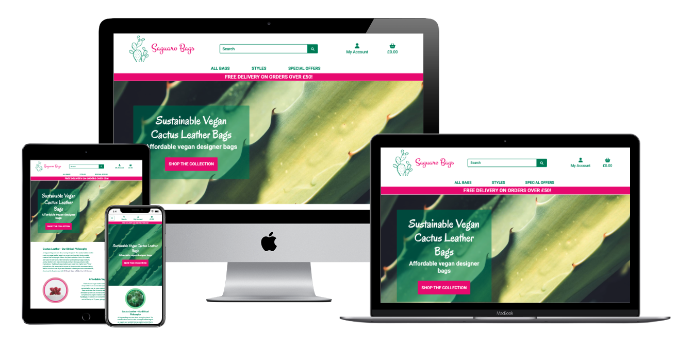

## UX (User Experience) 
### User Stories

EPIC 01: Viewing and Navigation

* USER STORY 01: View a List of Bags for Sale

    * As a **site user** I can **view a list of bags for sale** so that **I can choose some to purchase**
* USER STORY 2: View Individual Bag Details

    * As a **site user** I can **view individual bag details** so that **I can find out more information about the bag to inform my purchasing decision**
* USER STORY 3: Quickly Identify Bags on Sale and Bags with Free Charms

    * As a **site user** I can **quickly identify which bags are on sale and which bags come with a free charm** so that **I can take advantage of special savings and offers on bags I would like to purchase**
* USER STORY 4: View Bags by Style

    * As a **site user** I can **view a list of bags by style** so that **I can quickly find the type of bag I want to purchase**
* USER STORY 5: View Shopping Basket Total

    * As a **site user** I can **view my shopping basket total at any time** so that **I can keep track of what I'm spending and not overspend**
* USER STORY 6: Easily See the Purpose of the Website

    * As a **site user** I can **easily see the purpose of the website** so that **I clearly understand what the website is selling and the principles of the company selling the items **
* USER STORY 7: Site Navigation

    * As a **site user** I can **easily navigate the site** so that **I can find exactly what I want quickly**
* USER STORY 8: Errors

    * As a **site user** I can **see an error response page that is in keeping with the style of the website and can easily navigate back to the home page** so that **I am reassured that I am still navigating within the website and can easily get back to exploring the site**

EPIC 02: Searching and Sorting

* USER STORY 9: Sort the List of Available Bags

    * As a **site user** I can **sort the list of available bags** so that **I can easily see the bags I want according to price, rating, style, size, name and colour**
* USER STORY 10: Sort a Specific Category of Bag

    * As a **site user** I can **sort a specific category of bag** so that **I can easily see the bags in that category according to price, rating, name, style, size and colour**
* USER STORY 11: Searching for a Bag

    * As a **site user** I can **search for a bag by name** so that **I can find a specific bag I would like to purchase**
* USER STORY 12: Review Search Results

    * As a **site user** I can **easily see what I've searched for and the number of results** so that **I can quickly see if the bag that I want is available**

EPIC 03: Registration and User Accounts

* USER STORY 13: User Can Register for an Account

    * As a **site user** I can **register to create an account** so that **I have a personal account, can view my profile and can view my order history**
* USER STORY 14: Account Login and Logout

    * As a **site user with a registered account** I can **easily log in or out of my account** so that **I can access my personal account information**
* USER STORY 15: Reset Account Password

    * As a **site user with a registered account** I can **easily reset my account password if I forget it** so that **I can gain access to my account**
* USER STORY 16: Email Confirmation on Registration

    * As a **site user with a registered account** I can **receive an email confirmation after registering my account** so that **I can verify that my account registration was successful**
* USER STORY 17: Personal User Profile

    * As a **site user with a registered account** I can **have a personalised user profile** so that **I can view my personal order history and order confirmations and save my delivery information**

EPIC 04: Purchasing and Checkout

* USER STORY 18: Add Items to Shopping Basket

    * As a **site user** I can **easily select the quantity of a bag when adding it to my shopping basket and (if applicable) the free charm option I want** so that **I can choose the items I want to purchase**
* USER STORY 19: View Items in Basket

    * As a **site user** I can **view the bags (and if applicable charms) in my basket to be purchased** so that **I can see the total cost of my purchase and all of the items I will receive**
* USER STORY 20: Adjust Shopping Basket Item Quantities

    * As a **site user** I can **increase the quantity of items in my shopping basket or delete items** so that **I can easily make changes to my purchase before checkout**
* USER STORY 21: Complete Order Through Checkout Page

    * As a **site user** I can **complete my order via the checkout page** so that **I can see my final order details, enter or adjust my delivery address and enter my payment information**
* USER STORY 22: Secure Payment Process

    * As a **site user** I can **feel reassured that my payment information is safe and secure** so that **I can confidently provide the required information to make a purchase**
* USER STORY 23: Order Confirmation After Checkout

    * As a **site user** I can **view an order confirmation after checkout** so that **I can check what I ordered, total costs and see that the order has been successfully completed**
* USER STORY 24: Email Confirmation After Checkout

    *As a **site user** I can **receive an email confirmation after completing a purchase** so that **I can keep the confirmation of what I've purchased for my records**

EPIC 05: Admin and Store Management

* USER STORY 25: Add a Bag

    * As a **site admin** I can **add a bag** so that **I can add new items to my store**
* USER STORY 26: Edit/Update a Bag

    * As a **site admin** I can **edit/update a bag product** so that **I can change the bag name, image, size, colour, price and other criteria**
* USER STORY 27: Delete a Bag

    * As a **site admin** I can **delete a bag** so that **I can remove bags that are no longer for sale**

EPIC 06: SEO and Web Marketing

* USER STORY 28: Newsletter Subscription

    * As a **site user** I can **provide my email address to subscribe to newsletters** so that **I can keep up to date with the store's latest news**
* USER STORY 29: View Facebook Page

    * As a **site user** I can **visit the store's facebook page** so that **I can keep up with the site's latest news**
* USER STORY 30: SEO

    * As a **site user** I can **find the store site through searches** so that **I can easily access the site**
* USER STORY 31: Privacy Policy

    * As a **site user** I can **read the company's privacy policy** so that **I can be confident that the company is complying with GDPR laws**

## Features
### Existing Features
* Navigation Bar

    The navigation bar has the same appearance across all pages of the application and allows for easy user navigation. 
    
    On medium sized screens it contains the store name logo, Saguaro being a type of cactus and fitting in with the cactus theme. On larger screens it also has a cactus logo. Either of these can be clicked on to take the user back to the Home page which is a predictable and standard website convention. On larger screens the main navigation links appear horizontally under the full sized search bar. On smaller screens the main navigation links collapse into a burger menu and the search bar collapses into a magnifying glass logo. The burger menu also has a Home dropdown so the user can get back the Home page. The user can then click on the burger icon to see the stacked navigation links and can click on the magnifying glass to see the full search bar.

    A user who has not logged in to the site can see all the main navigation links relating to the bags but can only navigate to the register and login pages under 'My Account'. Any logged in user cannot see the login or register links but can see logout and my profile links. Admin users can in addition see Bag Management and Admin Panel links.

    A pink handbag icon appears next to all of the first tier main navigation links (relating to the bags) when a user hovers over or focusses on them. When a user hovers over or focusses on second tier navigation links, a purple tag icon appears next to those links.

    The navbar is fixed on larger screens to allow for easy navigation.

    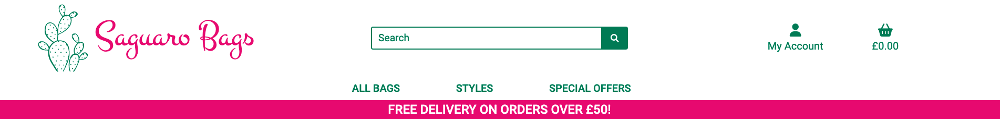
    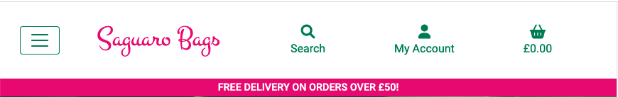
    

* Indicator of User Being Logged In

    The user can easily see at a glance whether or not they are logged in. If a user is not logged in, the user icon does not have a tick and 'My Account' appears underneath the icon. Logged in users can see a user icon with a tick and their username underneath. Usernames are truncated to 6 characters (plus …) on screens up to 991px wide and to 14 characters (plus …) on screens of 992px wide and larger. This keeps the navbar looking neat. 

    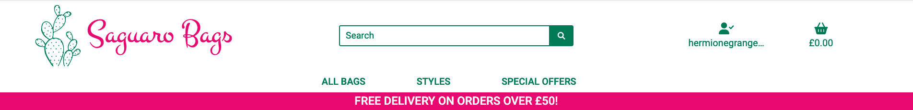
    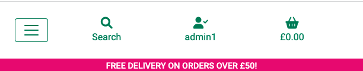

* Shopping Basket Link

    The shopping basket link is a green basket when empty. When a user hovers over or focusses on the icon, it changes to a purple trolley, providing a visual indication to users for accessibility purposes. The basket turns pink when the user has something in their shopping basket, so they can tell at a glance, making the shopping experience easier.

    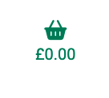
    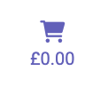
    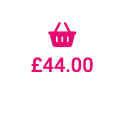

* Home Page & Store Ethos
    
    The Home page sets the scene for the store. The user is greeted with lots of cactus imagery relevant to the cactus leather theme of the store and a strong colour theme mimicking the green colour of a cactus and the bright pink colour of its flowers. There is a cactus favicon logo and, on larger screens, a cactus logo next to the store name. There is a big hero close up image of cactus leaves in keeping with the colour scheme. The user can immediately see what the store is selling from the hero image cover text and there is a call to action to Shop the Collection.

    Further down the page are three brief, easily digestable and informative pargraphs highlighting the benefits of cactus leather, the affordability of bags on the site and some educational information about how cactus leather is made. This helps the user understand what sets this store apart from other leather bag shops and the benefits to them of owning a cactus leather bag. It appeals to the current vegan and eco-conscious culture. The paragraphs each have a relevant image in an attractive circular border.

    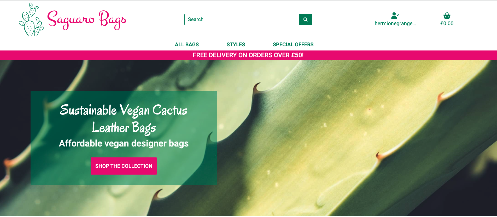
    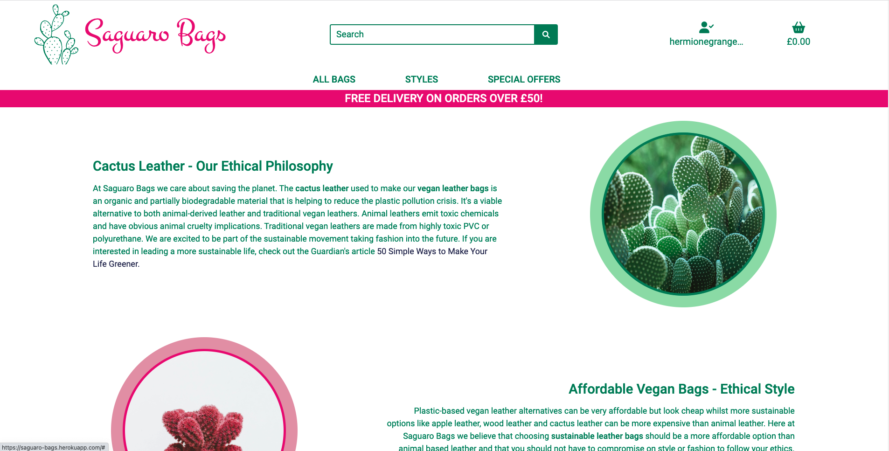

* View Bags

    The user can easily see all of the bags for sale on one page by clicking the All Bags option in the main navigation bar and then the next All Bags dropdown. Each bag has an image, its price, style, size, colour and rating shown. Additionally if the bag is on sale, the user can easily see this as the original price will be struck through and the reduced price shown. Any bags that have a free charm option also have a pink banner in the top left of the image. The bags are shown stacked on mobile screens, 2 per row on medium screens and 3 per row on larger screens. All bag images have the same height, keeping the rows looking neat and easy to scan through. There is a 'back to top' button that quickly and easily takes the user back to the top of the page. This button sits on top of anything underneath it so the user can see it at all times. 

    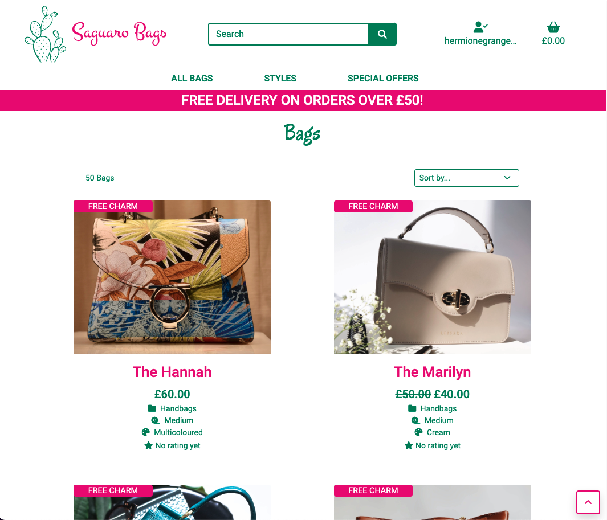

* Filter, Search and Sorting Options

    The navigation bar allows users to filter the bags they can see by style so that they can see just the style of bag they are interested in e.g. backpacks. Additionally, the user can filter the bags to just those with special offers (on sale and/or with a free charm option) or just those on sale or just those with a free charm option. 

    
    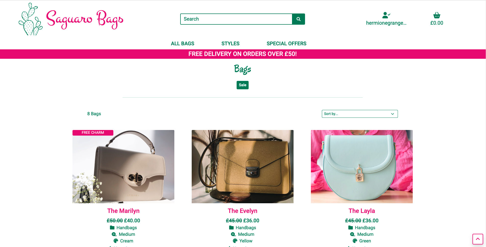

    The user can also search the bag names to restrict the bags they see to just those containing that search term. The number of items returned and the search term used are also displayed to the user. 

    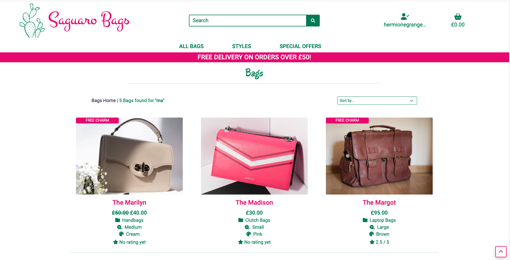

    The user can also order all the bags by price (low to high), rating (high to low), size (S-L), style (A-Z) or colour (A-Z) using the options on the All Bags navigation dropdown. Also, the user can sort whatever bags are currently showing on the page by: 

    * Price (low to high)
    * Price (high to low)
    * Style (A-Z)
    * Style (Z-A)
    * Colour (A-Z)
    * Colour (Z-A)
    * Rating (low to high)
    * Rating (high to low)
    * Bag name (A-Z)
    * Bag name (Z-A)
    * Size (S-L)
    * Size (L-S)

    All of these features assist the user to quickly find what they want on the site. 

    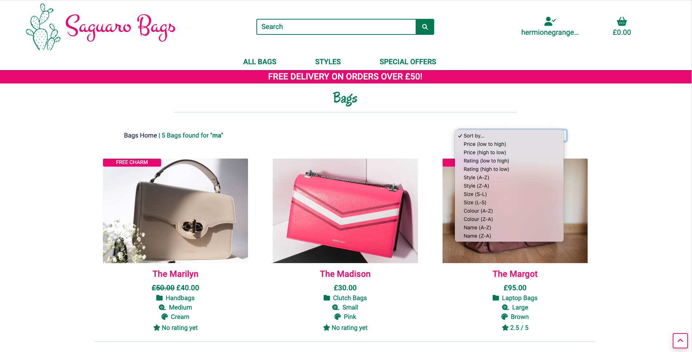

* Print Details Page

    The user can click on a bag to navigate to the details page which shows the user the bag image, name, sku, price, style, size, colour and rating. For bags without a charm option, the user can adjust the quantity easily using the plus and minus buttons before adding the bag to their basket. 

    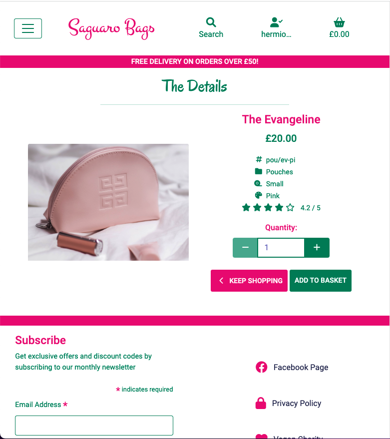

    For bags with a charm option, the user is shown all of the above details together with 3 radio button options for a free charm. Each charm has a small image and a name. The user can choose to select a charm, or if they do not want one, they can add the bag to their basket without a charm.

    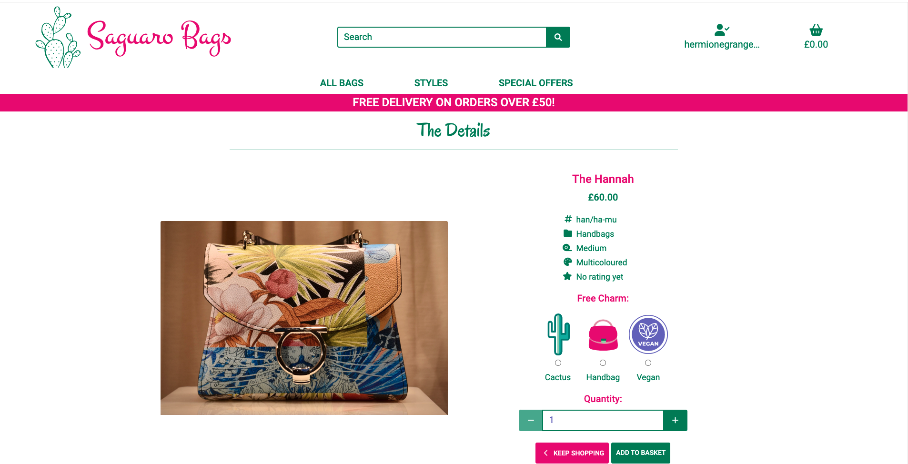

* Custom 404 and 500 Error Pages

    To keep consistent styling across the site, custom pages are displayed for any 404 or 500 HTTP response codes. If something goes wrong, the user is assured that they are still on the site and can easily navigate back to the home page.

    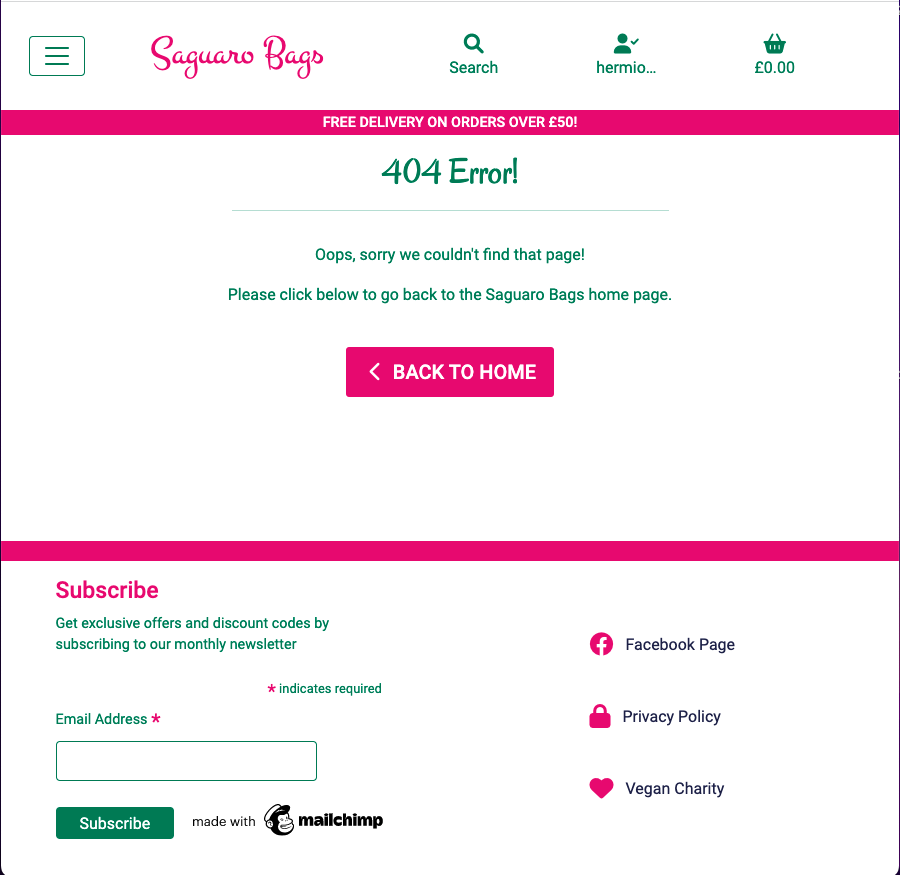

* Toasts

    Toasts provide user interaction throughout the application so the user can be assured that their actions have been acknowledged by the site. The toasts are also important in relaying any errors to the user as well as success messages. 

    For example, logging in and out, adding to or removing items from the shopping basket and completing a purchase all relay toasts to the user. 

    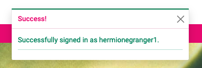
    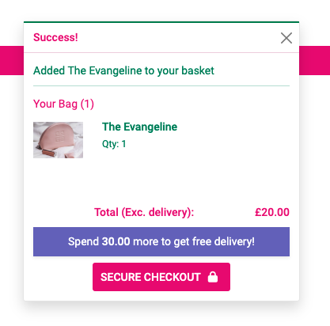
    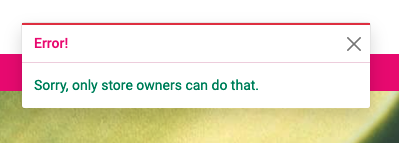

* User Authentication

     A user coming to the site for the first time can access the Register page via the navigation bar. The user needs to provide their email address, a username, their first and last names and a password to create an account. The email, first name and last name are required to contact a user e.g. to confirm purchases, and the first and last names are required for the checkout form. If the email address or username entered are already taken, the user will receive an error message. The user is asked to verify their email address to activate their account.

    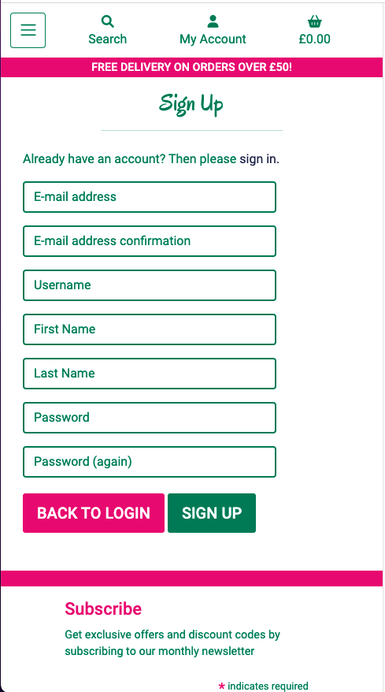

    Once a user has registered they can log in via the login page with their username or email and password.

    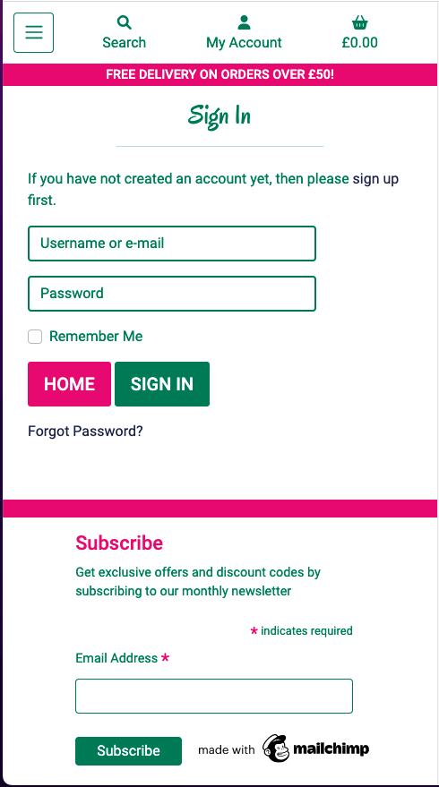

    When a user wants to log out they simply navigate to the logout page where they are asked to confirm that they are sure they would like to log out. If the user clicks that they are sure, they are logged out.

    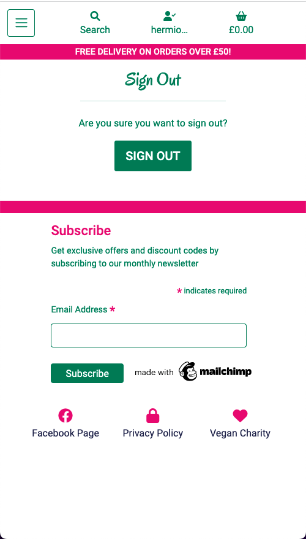

* Registered User Privileges

    If a registered user is logged in they can enter their default delivery information in their profile. These delivery details are then used to pre-populate the checkout form, allowing the user to check out much quicker. If the user wants to change their default delivery information, they can update it on the 'My Profile' page or they can enter their new delivery details on the checkout page and check the checkbox confirming that they would like to save those details to their profile. 

    In addition, once a logged in user has made a purchase, their previous orders appear in the 'My Profile' page. The user can click on any of the order number links to find out the full confirmation details for that order. The checkout success page has a toast to confirm to the user that the page they are looking at relates to an order in the past. This is of benefit to the user because they can quickly see all of the key information for past orders on the 'My Profile' page and can quickly find out the full details for an order via the order number link. This saves the user having to scroll back through emails to find out past order details. 

    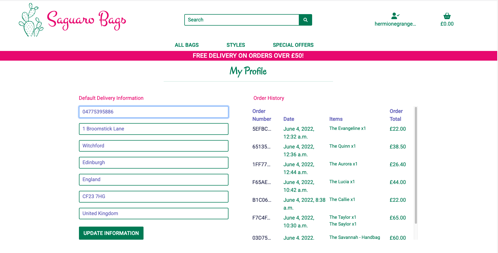
    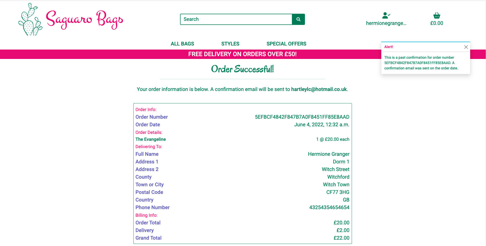

* Shopping Basket

    Whether or not a user is a registered user, they can purchase bags on the site. The shopping basket icon is in the top right of the screen. When hovered over or focussed on, the basket turns to a trolley. Users are familiar with a 'shopping basket' or 'shopping trolley' reprenting their shopping cart online. As the site is selling bags, the term shopping basket is used throughout the site and a bag icon is not used to avoid confusion. 

    As a user adds items to their shopping basket, the basket turns from green to pink and the basket total is udpated underneath the basket icon. By clicking on the basket, the user is taken to the Shopping Basket page where the user can update the quantity of each bag or bag/charm combination or delete a bag or bag/charm combination from the basket. The user also receives a toast every time they add to, edit or delete an item from their basket. 

    The user can choose to navigate to the Checkout page straight from an add/update/delete basket toast by clicking the Checkout button or by clicking the Checkout button on the Shopping Basket page. 

    The toasts relating to the user's basket and the Shopping Basket page, both let the user know how much more they will need to spend to get free delivery if they are below the free delivery threshold. 

    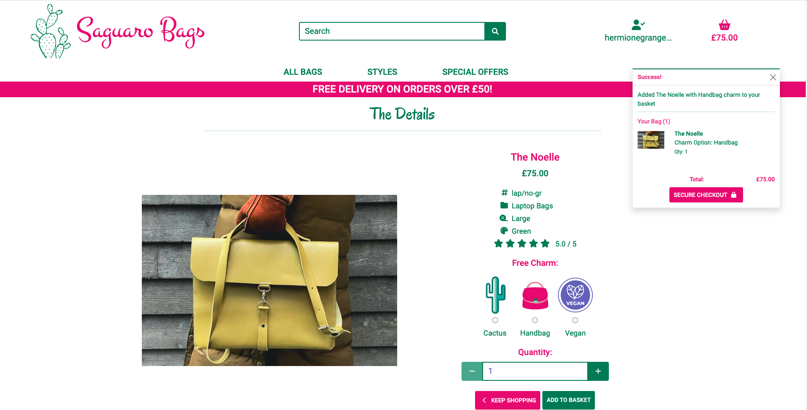
    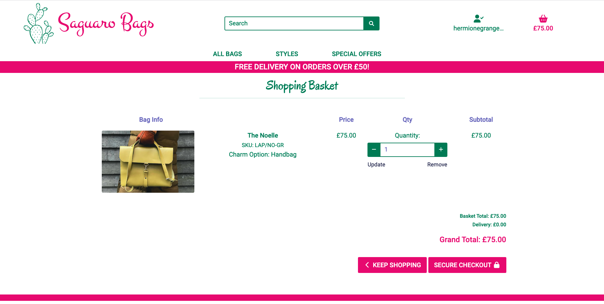

* Checkout

    To purchase the items in their basket, the user must navigate to the Checkout page. They can enter their contact and delivery details, or, if the user is registered and has already saved their delivery details to their profile, the checkout form is prepopulated. 

    Payments are handled by Stripe and so are secure. Webhooks ensure that purchases are completed, even if an error were to occur, e.g. the user closing the browser window before the checkout success page is shown. 

    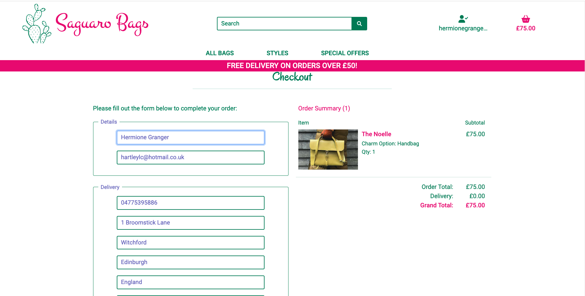

    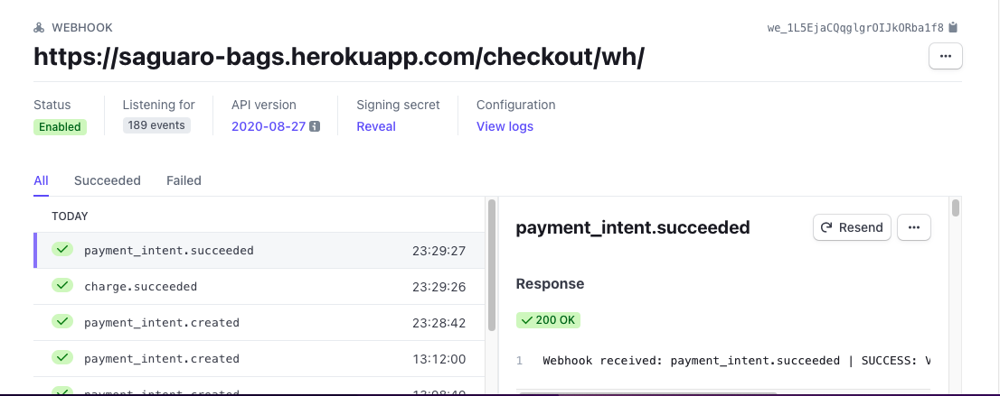

    As long as there are no errors, once the user's checkout has completed, they are taken to an 'Order Successful' page showing the details of their order.

    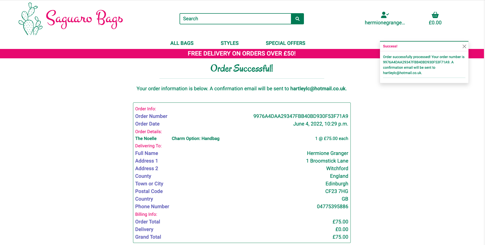

    As the webhook handler creates an order if the checkout view has not, the user should receive an order confirmation email for a successful checkout even if they close the browser before the checkout success page is displayed.

    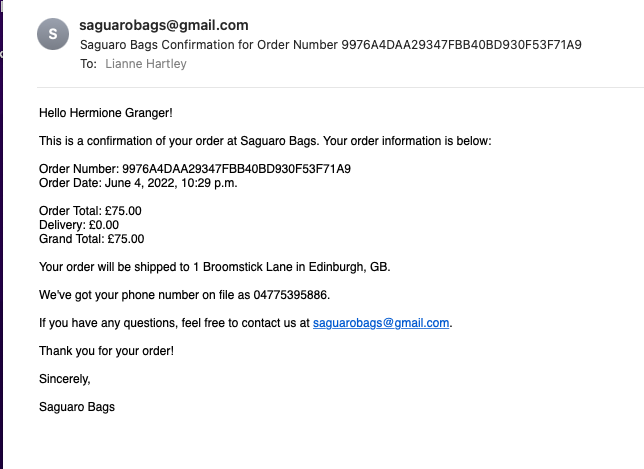

* Bag Management

    Only site admins are able to manage the bags for sale on the site. They can add new bags by navigating to the Bag Management dropdown from their user icon. The admin can fill out the form details to create a new bag. Once created the admin is taken to the bag's detail page and a toast confirms the bag has been successfully created. If the admin searches for the bag in the search bar it should appear in the results. If the admin tries to add a bag with the same name as another bag on the site or the same sku as another bag on the site, the admin will be prevented from doing so and an error message will appear underneath the relevant field. The check of the name and sku against those for existing bags ignores any uppercase/lowercase and spaces to ensure truly unique details. 

    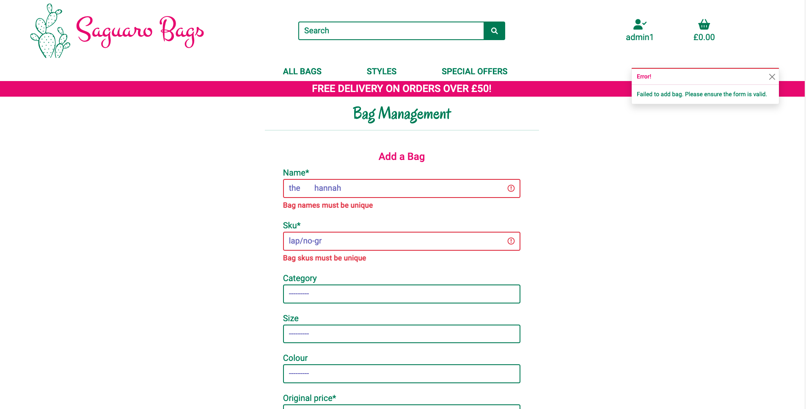

    Admins can also edit bags by navigating to the relevant bag detail page and clicking the 'edit' link. The admin is then taken to the edit form which will show any current image for that bag in a thumbnail. The admin can edit the bag details and will then be taken to the bag detail page showing the updated details together with an edit success toast.

    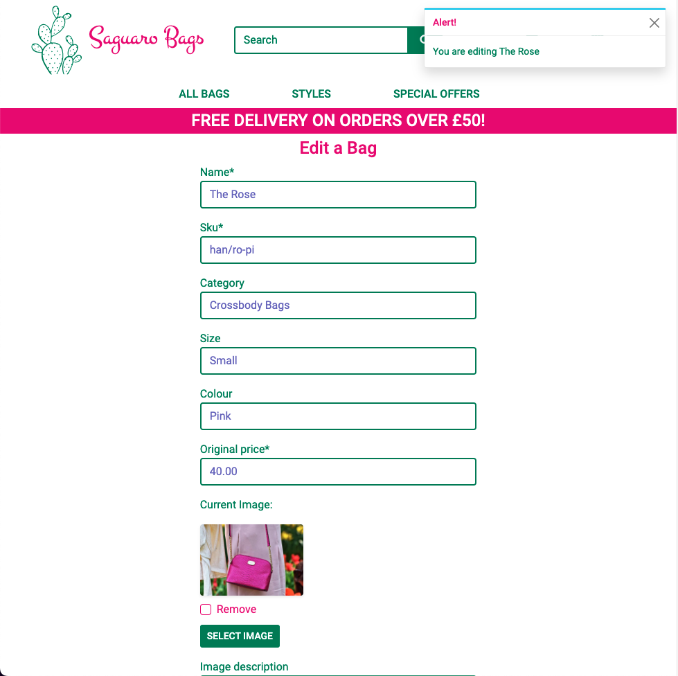

    In order to delete a bag, the admin can navigate to the relevant bag's bag detail page and click the 'delete' link. They will then be taken to the all bags page with a success toast confirming the bag has been deleted. 

    Being able to manage bags on the site itself means that admin users do not have to rely on the admin panel for this.

* SEO

* Marketing

* GDPR & Privacy

### Further Feature Ideas
* At the moment, the reviews for bags relies on the store owners manually collecting ratings (between 1 and 5) and entering the average score in the database. It would be good to have a system where registered users could leave ratings and reviews for items purchased. There would be a 'Leave a Review' button on each bag detail page only visible to registered users. If the user clicked on the button, they would only be able to proceed to the review page after a check was performed to make sure that user had purchased that bag. The form would be prepopulated with the user's name and purchase date, but the user could adjust their name if they wished for privacy reasons. The user would have to leave a rating between 1 and 5 (inclusive). If the user chose to leave a rating only and not a written review, their rating would appear immediately on the website. It would also be used to re-calculate the overall rating for the bag. If the user additionally wanted to leave a written review, the review would consist of a title and a body and the rating and review would require approval by the store admin before appearing on the site to filter out any inappropriate language. Again, once approved, the rating would be taken into account in updating the bag's overall rating. There would also be a chance to win a £100 store voucher by leaving a rating or review to encourage user registration.
* It would also be good if new registered users received a discount code in their signup email that they could redeeem against a first purchase. The code would be added on the checkout page and the appropriate percentage would be deducted from the user's first purchase total cost (excluding delivery). The code could also appear in their user profile. A check would need to be made to ensure that once used, the user could not used the same discount code again. Also, once the user used the discount code, it would need to disappear from their user profile. 

## Wireframes
I used [Balsamiq](https://www.balsamiq.com) to create Wireframe mock-ups for laptop/large monitor, tablet and mobile devices. 

*  [Wireframe]()

## Design

### Page Designs

### Fonts

I used [Google Fonts](https://fonts.google.com/) for the website fonts. The selected fonts and their fallbacks, should they not import into the site correctly, are as follows:

Selected Font | Fallback Font
------------- | --------------

### Colours

The colour scheme used on the site is as follows: 

Colour Name | Hexadecimal Code
------------| ---------
White | #FFFFFF
Spanish Viridian | #00855D
Green Sheen | #6DBAA1
Mexican Pink | #E4117A
Toolbox | #6C6EC4
Space Cadet | #1F2551
Rusty Red | #DC3545
Teal Deer | #9BDEAC
Charm Pink | #E199AE

### Entity Relationship Diagram

The entity relationship diagram for the project can be found [here](readme-documents/entity-relationship-diagram/DBMS ER diagram Saguaro Bags.png).

This diagram shows the multiple foreign key relationships between models and the one to one relationship between the User and UserProfile models. There are no many to many relationships. 

## Agile Methodology
A GitHub project with issues acting as the Product Backlog was used as the Agile tool for this project. Epics and linked user stories were created as issues and linked to milestones. There were 2 iterations of 2 weeks long with their own kanban boards. The first iteration had a total of 56 story points with 55% being must have user stories (31 points), 29% being should have user stories (16 points) and 16% being could have user stories (9 points). All were completed and moved along the kanban board. The second iteration had a total of 46 story points with 59% (27 points) being must have user stories, 22% being should have user stories (10 points) and 19% being could have user stories (9 points). All were completed and moved along the kanban board. The acceptance criteria for all user stories was tested in the Manual Testing document referenced in the TESTING.md file. 

The Product Backlog, Epics, User Stories and the 2 Iteration Boards can be accessed here: [Saguaro Bags Agile Tool](https://github.com/lhartley870/saguaro-bags/projects?type=beta).

## Search Engine Optimisation (SEO)

* Initial list of short-tail keywords:

    * Vegan leather
    * Vegan leather bags
    * Cactus leather
    * Cactus leather bags
    * Eco leather 
    * Eco leather bags
    * Sustainable bags

* Additional keywords found by Google searching the initial list:

    * Keyword Searched: Vegan leather 
        * Vegan leather made from plants
        * Vegan leather bags
        * Vegan leather handbags
        * Vegan leather made from
    
    * Keyword Searched: Vegan leather bags
        * Affordable vegan handbags uk
        * Vegan leather handbags uk
        * Vegan leather bags uk
        * Vegan leather bags cactus
        * Vegan leather bags designer

    * Keyword Searched: Cactus leather
        * Where to buy cactus leather
        * Cactus leather uk
        * Cactus leather fabric
        * Is cactus leather biodegradable
        * Desserto cactus leather
        * Cactus leather manufacturers

    * Keyword Searched: Cactus leather bags
        * Vegan cactus bags
        * Handbags made from cactus
        * Cactus leather weekend bag
        * Where to buy cactus leather

    * Keyword Searched: Eco leather
        * Eco leather vs real leather
        * Eco leather vs faux leather
        * Does eco leather last

    * Keyword Searched: Eco leather bags
        * Sustainable bags uk
        * Sustainable bags
        * Sustainable handbag brands
        * Sustainable tote bags

    * Keyword Searched: Sustainable bags
        * Sustainable bags uk
        * Sustainable bag brands

    * Keyword Searched: Sustainable handbags
        * Sustainable handbags uk
        * Sustainable bag brands
        * Sustainable leather bags
        * Vegan sustainable handbags 

* Considering relevance
    * List of keywords narrowed down to exclude the following:
        * The website probably doesn't meet the need behind the following keyword searches as they appear to be more to do with people wanting to buy the cactus leather itself, possible for manufacturing their own products:
            * Where to buy cactus leather
            * Cactus leather fabric
            * Cactus leather manufacturers
        * While the website does mention that cactus leather is partially biodegradable, the site's purpose does not include a detailed account of the properties of cactus leather:
            * Is cactus leather biodegradable
            * Does eco leather last
        * As the site offers a variety of bags, it is perhaps not that helpful to use keywords for specific bag types:
            * Cactus leather weekend bag
            * Sustainable tote bags
        * These keywords are going to be too generic:
            * Vegan leather made from plants
            * Cactus leather uk
            * Vegan leather made from
            * Eco leather vs real leather
            * Eco leather vs faux leather
            * Sustainable bags uk
            * Sustainable bags
            * Sustainable handbag brands
            * Sustainable bags uk
            * Sustainable bag brands
            * Sustainable handbags uk
            * Sustainable bag brands
            
    * Desserto cactus leather has been left in as a relevant keywords because the home page specifically mentions them as a cactus leather manufacturer and includes a link to their website.

* Considering authority
    * Saguaro bags can speak from a place of authority about the following keywords as it is a store selling vegan cactus leather designer bags at an affordable price:
        * Vegan leather bags
        * Vegan leather handbags
        * Affordable vegan handbags uk
        * Vegan leather handbags uk
        * Vegan leather bags uk
        * Vegan leather bags cactus
        * Vegan leather bags designer        
        * Vegan cactus bags
        * Handbags made from cactus
        * Sustainable leather bags
        * Vegan sustainable handbags 
    * Also, being as the site includes information about Desserto's cactus leather and a link to their home page, it can also speak from a place of authority about Desserto:
        * Desserto cactus leather
        
* Considering volume
    * Using the [Wordtracker](https://www.wordtracker.com/) website for searching a number of the above keywords, the following helpful results were found where the balance between a high volume of searches and a reasonable volume of competition was good:

        Keyword | Volume | Competition
        ------------| --------- | ---------
        Vegan designer bags | 1,650 | 5.63
        Cactus leather bag | 383 | -
        Cactus leather handbags | 114 | -
        Desserto leather | 619 | -

* The final keywords list chosen is:
    * Vegan leather bags
    * Vegan designer bags
    * Affordable vegan handbags uk
    * Vegan leather bags cactus
    * Cactus leather
    * Cactus leather bag
    * Cactus leather handbags
    * Desserto cactus leather
    * Desserto leather
    * Sustainable leather bags
              
* The keywords were implemented in the site as follows:
    * Putting h1 and h2 tags in the overlay to the home page hero image and using keywords within these tags.
    * Using keywords in the home page information section headings and in strong tags within the information paragraphs themselves.
    * Adding an external link to the home page to a Guardian article on living more sustainably.
    * Including a footer link to a vegan charity and using the word vegan in the link text and aria-label.
    * Including a link to Desserto's homepage, a leading manufacturer of cactus leather who rank well in keyword searches.
    * Including all the keywords in the meta keywords tag content attribute.
    * All of the alt attributes for the 50 bags being sold on the site include the words 'cactus leather'.

* Ideally I would have liked to refer to Desserto as a partner on the home page, but being as the site is not a real e-commerce site and has not partnered with Desserto, I have refrained from doing this. However, were this a real site that had partnered with Desserto, then I would include further references to them to improve the SEO.
    
## Technologies Used

### Languages 
* [HTML5](https://en.wikipedia.org/wiki/HTML5) programming language for the structure and content of the website.
* [CSS3](https://en.wikipedia.org/wiki/CSS) for styling the look of the website.
* [JavaScript](https://en.wikipedia.org/wiki/JavaScript) for adding interactivity to the website. 
* [Python](https://en.wikipedia.org/wiki/Python_(programming_language)) programming language for the logic of the application.

### Frameworks, Libraries and Modules
* [Django](https://www.djangoproject.com/) was the python framework used to allow rapid, secure development and the clean, pragmatic design of this application.
* [Bootstrap](https://getbootstrap.com/) was the framework used to assist in the building of a responsive, mobile-first site.
* [Gunicorn](https://gunicorn.org/) was used as the python WSGI HTTP Server to run Django on Heroku.
* [dj_database_url](https://pypi.org/project/dj-database-url/) was used so that database URLs could be used in the Django Application to connect to the Postgres database.
* [psycopg2](https://pypi.org/project/psycopg2/) was the PostgreSQL database adapter used for the Python programming language.
* [django-allauth](https://django-allauth.readthedocs.io/en/latest/installation.html) was used for authentication, registration and account management for the application.
* [django-crispy-forms](https://django-crispy-forms.readthedocs.io/en/latest/) was used to help manage the formatting of forms in the django application.
* [django-countries](https://pypi.org/project/django-countries/) was used to provide a CountryField for the Order and UserProfile models. 
* [Pillow](https://pypi.org/project/Pillow/) Python Imaging Library was used to add image processing capabilities to the Python interpreter.
* [Stripe python library](https://pypi.org/project/stripe/) was used for Stripe's API.
* [boto3](https://pypi.org/project/boto3/) was used as the Amazon Web Services (AWS) Software Development Kit (SDK) for Python.
* [django-storages](https://pypi.org/project/django-storages/) was used to connect django to S3.
* [Jquery](https://jquery.com/) was used to assist with HTML document traversal, manipulation and event handling.
* The [inbuilt python math module](https://docs.python.org/3/library/math.html) was used to find the largest integer less than or equal to a given number when calculating the number of review stars to display in the Bag model's get_number_rating_stars method in the products app.
* The [inbuilt python decimal module](https://docs.python.org/3/library/decimal.html) was used to to deal with monetary calculations in the get_discounted_price method of the Bag model in the products app and to calculate delivery costs in the basket app's contexts file.
* The [inbuilt python uuid module](https://docs.python.org/3/library/uuid.html) was used to generate 32 character random unique order numbers in the checkout app Order model. 
* The [inbuilt python json module](https://docs.python.org/3/library/json.html) was used to serialize the basket object as a JSON formatted stream for the purposes of including it within the Stripe payment intent metadata.

### Programs and Resources
* [Git](https://git-scm.com/) was the version control system used via the Gitpod terminal to commit and push code to GitHub.
* [GitHub](https://github.com/) was the git repository hosting service used to store code pushed from Git.
* [Gitpod](https://www.gitpod.io/) was the online IDE (Integrated Development Environment)/editor used to create, modify and preview the project code. 
* [Heroku](https://www.heroku.com/) was the cloud application platform used to deploy and host the application.
* [Lucidchart](https://www.lucidchart.com/pages/) was used to prepare the Entity Relationship Diagram. 
* [The Multi Device Website Mockup Generator](https://techsini.com/multi-mockup/index.php) was used to create the screenshots showing how the website looks on different device types in conjunction with the [Ignore X-Frame headers Google Chrome Extension](https://chrome.google.com/webstore/detail/ignore-x-frame-headers/gleekbfjekiniecknbkamfmkohkpodhe).
* [Google Fonts](https://fonts.google.com/) was used to import all of the fonts used on the website. 
* [Font Awesome](https://fontawesome.com/) was used to provide all the icons throughout the site.  
* [Balsamiq](https://www.balsamiq.com) was used to prepare the Wireframes for the site. 
* [Chrome DevTools](https://developer.chrome.com/docs/devtools/) was used to inspect the project code throughout creation of the site. 
* [ColorSpace](https://mycolor.space/) was used to generate the colour palettes from which most of the colours for the website were taken. 
* [Color Name](https://www.color-name.com/) was used to find out the names of the hex code colours used on the site.
* [Favicon Generator](https://favicon.io/favicon-generator/) was used to create the favicon for the site. 
* [Unsplash](https://unsplash.com/), [Pexels](https://www.pexels.com/) and [Pixabay](https://pixabay.com/) provided free photos used throughout the site.
* [Amazon S3](https://aws.amazon.com/s3/) was used to store the static and media files used by the application.
* [Stripe](https://stripe.com/gb) was used to provide secure payments for the site.
* [Gorgias Free SKU Generator](https://www.gorgias.com/tools/sku-generator) was used to generate the sku codes of the bags for sale. 
* [Privacy Policy Generator](https://www.privacypolicygenerator.info/) was used to generate the privacy policy.
* [Google](https://www.google.com/) was used for finding keywords for SEO (Search Engine Optimisation) of the site.
* [Wordtracker](https://www.wordtracker.com/) for finding out volume and competition information for keyword searches.
* [Fake UK Phone Numbers](https://fakenumber.org/united-kingdom) was used to generate a fake phone number for the site for use on the Facebook Page.
* [XML Sitemaps](https://www.xml-sitemaps.com/) was used to generate the sitemap.xml file.
* [W3 Schools](https://www.w3schools.com/), [Stack Overflow](https://stackoverflow.com/), [CSS-Tricks](https://css-tricks.com/), [MDN Web Docs](https://developer.mozilla.org/en-US/), [Python.org](https://www.python.org/) and [Django documentation](https://docs.djangoproject.com/en/4.0/) were used for general guidance and learning.  
* [What is my Viewport?](https://whatismyviewport.com/) was used to confirm the viewport screen sizes of my devices for testing the project. 
* [Can I Use?](https://caniuse.com/) was used for checking browser compatibility.
* [Compressor](https://compressor.io/) and [Tiny PNG](https://tinypng.com/) were used for compressing photos used on the site. 
* [WebAIM Contrast Checker](https://webaim.org/resources/contrastchecker/) was used to check the contrast of foreground text colours against their background colours.
* [The W3C Markup Validation Service](https://validator.w3.org/), [The W3C CSS Validation Service](https://jigsaw.w3.org/css-validator/), [JSHint](https://jshint.com/) and [PEP8 Online](http://pep8online.com/), were used for testing the html, css, javascript and  python code for the site.
* [Markdown Cheatsheet](https://github.com/adam-p/markdown-here/wiki/Markdown-Cheatsheet) and [Mastering Markdown](https://guides.github.com/features/mastering-markdown/) were used for preparing the README.md and TESTING.md files.
* [Django Secret Key Generator](https://miniwebtool.com/django-secret-key-generator/) was used to generate secret keys for the development and production environments.
* [Character Counter Online](https://www.charactercountonline.com/) was used for counting the number of characters in git commit messages.
* [cdnjs](https://cdnjs.com/) was used to provide CDN links.
* [Canva](https://www.canva.com/en_gb/) was used for the logo and favicon illustrations used on the site.
* [Color hex](https://www.color-hex.com/) was used to convert hex colours into rgb colours.
* [Project management on Github](https://www.topcoder.com/thrive/articles/project-management-on-github), [User Stories and Epics for the Win article](https://www.christianstrunk.com/blog/user-stories-and-epics-for-the-win), [Atlassian Agile epics: definition, examples, and templates article](https://www.atlassian.com/agile/project-management/epics) and [A Complete Guide to Agile Epics article](https://www.wrike.com/agile-guide/agile-epics-guide/) were used in drafting the epics and user stories. 

## Testing

Please see the separate [TESTING.md file](TESTING.md) for details of the project testing carried out. 

## Deployment
The steps below set out how to create your own copy of this project and configure and deploy the application. 

### Forking the GitHub Repository

Forking the GitHub repository allows you to produce a personal copy of the original repository/someone else's project that you can amend without affecting the original repository. To do this:

1. Log in to GitHub.
2. Navigate to the repository that you want to fork. In this case https://github.com/lhartley870/saguaro-bags.
3. In the repository header locate the button that says 'Fork' and click on it.  
4. When the repository is copied you will be taken to your copy of the repository. 

### Making a Local Clone

In order to work on a repository you have forked, you will need to clone it to your computer. In order to do this: 

1. Log in to GitHub and locate the repository fork you want to make a local clone of. 
2. Underneath the Settings button at the top of the repository there is a button with a dropdown arrow that says 'Code'. Click on it.  
3. To clone the repository using HTTPS, undeneath 'Clone' select 'HTTPS' so that there is an orange line underneath 'HTTPS'. Click on this button:

    

4. Open the Terminal in your IDE/editor. 
5. Change the current working directory to the one where you want the cloned directory to be located.  
6. Type 'git clone' and then paste the URL you copied earlier. It will look like this with your username instead of 'YOUR-USERNAME' and the name of the forked repository you are cloning instead of 'NAME OF REPOSITORY YOU ARE CLONING': 

7. Press enter and your local clone will be created. 
8. You will need to install the packages and libraries used by this project. To do this use this command in your terminal: pip install -r requirements.txt
9. Ensure that DEBUG=True in the settings.py file when you are in the development environment.

For more information on forking and cloning repositories, see [GitHub Docs](https://docs.github.com/en/get-started/quickstart/fork-a-repo) and this [GitHub Guide](https://guides.github.com/activities/forking/). 

### Heroku

The project was deployed according to the following steps: 

1. Log into Heroku at https://www.heroku.com/.
2. From the Dashboard, Click on the 'New' button and then the dropdown button called 'Create new app'.

3. Enter a unique App name and select your region as either 'Europe' or 'United States'. If the app name is unique you will get a green tick and a message saying that your chosen name is available, otherwise you will see a red exclamation mark and a message saying that the name is unavailable.

4. Click on 'Create app'.
5. Click on the 'Resources' tab towards the top of the page. 
6. In the Add-ons search bar type 'postgres'. 
7. Select 'Heroku Postgres' and click on 'Submit Order Form' in the pop-up box that appears.
8. Click on 'Settings' in the bar across the top of the page. You will then be taken to a page that looks like this:

9. Scroll down to where it says 'Config Vars' down the left hand side of the page and click on 'Reveal Config Vars'.
10. Check that the DATABASE_URL has automatically been entered as a Config Var.
11. Add a new Config Var in Heroku called DISABLE_COLLECTSTATIC and give it a value of 1.
12. Use an online secret key generator to generate a secret key and add another Config Var called SECRET_KEY and copy the secret key generated as the value.
13. In order to run your application on localhost generate a different secret key to the one you have entered in the Heroku Config Vars and add this to your environment variables. For example, if you are using Gitpod, navigate to your Gitpod Workspaces, click on Settings and then Variables. Click on 'New Variable' and enter the name as SECRET_KEY, the value as the secret key you have generated and the scope as your GitHub username followed by a forward slash and your repository name. Click on 'Add Variable'.
14. In the settings.py file, ensure your SECRET_KEY value reads as follows:

    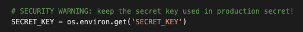
15. At the top of the settings.py file import os and dj_database_url.
16. Temporarily comment out the current DATABASE variable and replace it with this:

    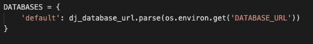
17. To migrate the database model to the Postgres database, in the command line type: python3 manage.py migrate
18. To add the content of the fixtures files to the Postgres database, type these commands in the following order in the command line (the command for bags must come last as it depends on the other fixtures files being added to the database first):
    * python3 manage.py loaddata categories
    * python3 manage.py loaddata charms
    * python3 manage.py loaddata colours
    * python3 manage.py loaddata discounts
    * python3 manage.py loaddata sizes
    * python3 manage.py loaddata bags
19. Set up an admin superuser in the Postgres database using the command: python3 manage.py createsuperuser and follow the prompts, entering an email address, username and password.
20. To use the Postgres database in production, and the sqlite database locally, ensure the database setting in settings.py is changed to the following:
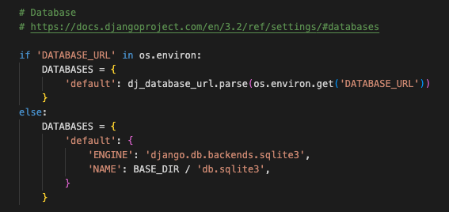
21. To add the fixtures data to your local sqlite database and add an admin superuser, repeat steps 17-19 once you have changed the database setting as per step 20.
22. Set DEBUG to False in settings.py.
23. Ensure that your application is included in the settings.py file as an allowed host e.g. ALLOWED_HOSTS = ['saguaro-bags.herokuapp.com', 'localhost']
24. Make sure the requirements.txt file has all the latest changes by typing: pip3 freeze --local > requirements.txt
25. Commit and push any changes made locally to GitHub.

### Connect your Heroku App to the GitHub Repository
1. Login to Heroku and navigate to your application.
2. Click on 'Deployment' in the bar across the top of the page.
3. Where it says 'Deployment Method' on the left hand side of the screen click on GitHub.
4. Where it says 'Connect to GitHub' down the left hand side of the screen, type your repository name and click 'Search'.
5. Click on 'Connect' next to your repository name.
6. Scroll down to where it says 'Automatic Deploys' and 'Manual Deploy' down the left hand side of the screen. 
7. If you want Heroku to rebuild your app every time any new changes to the code are pushed to GitHub, check that the branch you want to deploy is correct and click on 'Enable Automatic Deploys'. You will then need to check that the branch you want to deploy is correct and click on 'Deploy Branch' in the Manual Deploy' section. 
8. If you only want to manually deploy, check that the branch you want to deploy is correct and click on 'Deploy Branch' in the 'Manual Deploy' section.
9. Alternatively, you can manually deploy from the command line interface (CLI). Assuming you do not have MFA/2DA enabled, to log into Heroku from your terminal type: heroku login -i, then enter your Heroku username and password when prompted. You can get your app name from Heroku by typing the following command: heroku apps. To set the Heroku remote enter the following command in the terminal (but replacing APP_NAME with your actual app name): heroku git:remote -a APP_NAME. Then to manually deploy enter the command: git push heroku main. This step 9 assumes you have already pushed all your latest changes to GitHub beforehand.
10. Click on 'View' or 'Open app' in Heroku and you will be taken to the deployed application. 
10. When your app has successfully deployed, at this stage you should see your application but without any static or media files (so you won't see any styling or photographs for example).

### Configure Amazon Web Services S3
1. Log in to AWS at https://aws.amazon.com/ or create an account if you do not already have one.
2. From the dashboard, navigate to the S3 services (e.g. by typing s3 in the search bar).
3. Click on 'Create bucket'. Name your bucket. It is recommended to give your bucket a name to match your Heroku app name. Choose the region closest to you. Under 'Object Ownership' click the 'ACLs enabled' radio button and then the 'Bucket owner preferred' radio button. Uncheck 'Block all public access' and click the checkbox to ackowledge that the bucket will be public. Click on 'Create bucket'. 
4. Click on your bucket and then on the 'Properties' tab. Scroll down to 'Static website hosting' and click on 'Edit'. Under 'Static website hosting' click the 'Enable' radio button. Under 'Hosting type' click the 'Host a static website' radio button. Fill in some default values for the index and error documents as these will not be used e.g. index.html under 'Index document' and error.html under 'Error document'. Click 'Save'.
5. Go to the 'Permissions' tab. 
    * Scroll down to 'Cross-origin resource sharing (CORS)'. Click on edit, paste in the following, then click 'Save':

        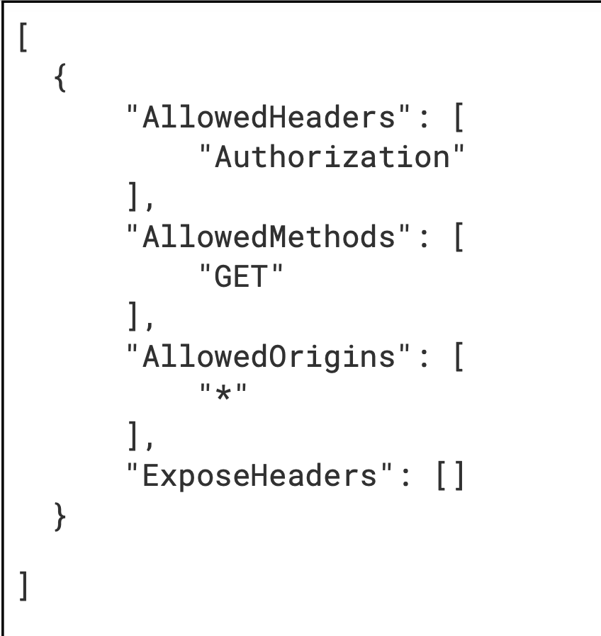

    * Scroll down to 'Bucket policy'. Click on edit and click on 'Policy generator'. A new tab will open. Underneath 'Select Policy Type' choose 'S3 Bucket Policy'. Underneath 'Add Statement(s) in the 'Principal' input box type '*'. From the 'Actions' dropdown select 'GetObject'. Go back to the original tab and copy the 'Bucket ARN' located in the 'Bucket policy' section. Back in the policy generator tab, paste that ARN next to 'Amazon Resource Name (ARN)'. Click 'Add Statement', then 'Generate Policy'. Copy the json from the 'Policy JSON Document' modal that appears and close the AWS Policy Generator tab. Paste that JSON back in your original tab in the 'Bucket Policy' section, adding a forward slash followed by an asterisk at the end of the Resource key value before the closing quotation marks. Click 'Save'. 
    * Scroll down to the 'Access control list (ACL)' section and click on 'Edit'. Next to 'Everyone (public access)' check the 'List' checkbox and check the warning box. Click 'Save'.
6. Access the 'IAM' service by finding it via the Services menu or searching for 'IAM' in the search bar.
    * Under 'Access Management' in the menu on the left hand side, click on 'User groups' and then 'Create group'. Add a 'User group name' e.g. 'manage-saguaro-bags' and click on 'Create group'.
    * Under 'Access Management' click on 'Policies' and then 'Create Policy'. Go to the 'JSON' tab and click the 'Import managed policy' link. Search for 's3', select 'AmazonS3FullAccess' and click 'Import'. Open your bucket in a new tab, go to the 'Permissions' tab and copy your 'Bucket ARN' located in the 'Bucket policy' section. Replace the 'Resource' key value with an array so that it looks like this (but replacing 'your bucket ARN goes here' with your own bucket ARN, noting the forward slash and asterisk added to the second list item):
    "Resource": [
        "YOUR BUCKET ARN GOES HERE",
        "YOUR BUCKET ARN GOES HERE/*"
    ]
    Click 'Next: Tags' and then 'Review policy'. Give the policy a name e.g. 'saguro-bags-policy' and a description e.g. 'Access to S3 bucket for Saguaro Bags static files'. Then click 'Create policy'. This will take you back to the Policies page where you can see that your policy has been created.  
    * To attach your policy to your group, click on 'User Groups', then click on your group. Go to the 'Permissions' tab, open the 'Add permissions' dropdown and click 'Attach policies'. Select your policy and click 'Add permissions' at the bottom. 
    * To create a user to put in the group, click on 'Users' in the left hand menu, then 'Add users'. Name the user e.g. saguaro-bags-staticfiles-user and check the 'Access key - Programmatic access' checkbox. Click on 'Next: Permissions' and click the checkbox next to the group you created. Click 'Next: Tags', then 'Next: Review', then 'Create user'. 
    * Download and save the generated csv file NB. it is VERY IMPORTANT the you download and save this csv file as once you've gone through this process you will not be able to download it again. 
7. In your settings.py file, change the value of the 'AWS_STORAGE_BUCKET_NAME' variable to your bucket name and the 'AWS_S3_REGION_NAME' to your bucket region. 
8. In Heroku, go to your app Settings tab and your Config Vars.
    * Add a Config Var with a key of 'USE_AWS' and a value of 'True'.
    * Add a Config Var with a key of 'AWS_ACCESS_KEY_ID' and the corresponding value from the cvs file you downloaded.
    * Add a Config Var with a key of 'AWS_SECRET_ACCESS_KEY' and the corresponding value from the cvs file you downloaded.
9. Delete the 'DISABLE_COLLECTSTATIC' Config Var - Django will now use S3 to store static and media files when it runs python3 manage.py collectstatic during the build process.
10. Commit and push your changes to the settings.py file (as mentioned in step 7) to GitHub. All other settings for AWS configuration are already in the existing settings.py file.
11. If you have set up Heroku to automatically deploy every time you push to GitHub, when an automatic deployment occurs after step 10, the static files should be stored in S3 so you should see e.g. all your styling included in your css files on the deployed site. If you are deploying manually you will need to deploy manually again to see the styling on your deployed site.
12. Go to the S3 dashboard and create a file called 'media' in your new bucket. Inside the media folder click 'Upload', download all the media files from the repository and drag and drop them into the bucket media folder. Under the 'Permissions' dropdown, in 'Access control list (ACL)', under 'Predefined ACLs' select the 'Grant public-read access' radio button. Check the warning checkbox and click 'Upload'. You should then see your media files displayed on your deployed site.

### Verify Superuser Email Address
1. Attempt to login as the superuser on the deployed site itself. When you get to the email verification page, login to the admin panel (this can be accessed by adding '/admin' to the end of the home page url) and enter the superuser username and password you created earlier.
2. Click on 'Email Addresses' and select the superuser email address. Check the checkboxes for 'Verified' and 'Primary' and click 'Save'. 
3. You should now be able to login to the deployed site as an admin. 

### Stripe Configuration
1. Login to your Stripe account at https://stripe.com/gb.
2. Click on 'Developers' near the top right of the screen.
3. In Heroku add two more Config Vars to your application with keys of STRIPE_PUBLIC_KEY and STRIPE_SECRET_KEY.
4. Click on 'API Keys' in the Stripe left hand menu, copy the Publishable key and paste it as the value for STRIPE_PUBLIC_KEY in the Config Vars. Copy the Secret Key in Stripe and paste it as the value for STRIPE_SECRET_KEY in the Config Vars. In this case, the test keys were used for this purpose.
5. To create a new webhook endpoint, click on 'Webhooks' in the Stripe left hand menu and click on the 'Add endpoint' button. Under 'Endpoint URL' paste your deployed application url with '/checkout/wh/' added onto the end. Under 'Select events to listen to' click the 'Select events' button, check the 'Select all events' checkbox and click 'Add events'. Then click 'Add endpoint'. 
6. Click on your newly created webhook endpoint and under 'Signing secret' click on 'Reveal'. Copy the signing secret.
7. In Heroku add another Config Var with a key of STRIPE_WH_SECRET and paste the signing secret from Stripe as its value.

### Configuring Django to Send Real Emails
1. The email configuration steps below assume that you are using a gmail account. If you are not, the procedure will differ depending on which provider you use.
2. Login to your Gmail account and click on Settings in the upper right. 
3. Go to the 'Accounts and Import' tab and next to 'Change account settings' click on 'Other Google Account settings'. 
4. Click on the 'Security' tab down the left hand side and click on '2 Step Verification'. This will allow you to create an app password specific to your django app that will allow it to authenticate and use your Gmail account to send emails.
5. Click 'Get Started', enter your password and select a verification method.
6. Once you have verified, turn on 2 step verification by clicking 'TURN ON'.
7. Go back to your Gmail dashboard and click on 'Security' down the left hand side. 
8. You should now have an option called 'App passwords' under the 'Signing in to Google' heading. Click on it and enter your Gmail password.
9. On the 'App passwords' screen, from the 'Select app' dropdown choose 'Mail', and for the 'Select device' dropdown choose 'Other (Custom name)'. You can set whatever you want here e.g. Django.
10. Click 'Generate' and you will be given a 16 character password. Copy it.
11. In Heroku, add a Config Var key called EMAIL_HOST_PASS and paste your Gmail app password in as its value.
12. Add another Config Var with a key of EMAIL_HOST_USER and enter your gmail email address as its value.
13. All of the relevant settings are already included in the settings.py file although you may want to update the DEFAULT_FROM_EMAIL variable for the development environment to another email address. You will also need to set an environment variable of DEVELOPMENT with a value of True as referred to in the Heroku section, step 13 above, to use the development email configuration settings.
14. If you do make any changes to settings.py these should be committed and pushed to GitHub. If you are not set up for automatic deployment, you should deploy manually again.

## Credits 

### Code
The Code Institute Boutique Ado project was heavily relied upon throughout the building of this project. In addition:

* **Profiles forms.py file**
    * Code for the CustomSignUpForm class is based upon code included in an article entitled ['The complete django-allauth guide' by Gajesh](https://dev.to/gajesh/the-complete-django-allauth-guide-la3).
    * Code for validating the first_name and last_name fields in the CustomSignUpForm class so that only letters are allowed was adapted from an answer given by Martijn Pieters and edited by Lord Elrond on [this Stack Overflow post](https://stackoverflow.com/questions/17165147/how-can-i-make-a-django-form-field-contain-only-alphanumeric-characters).

* **Profiles views.py file**
    * The solution of using the @cache_control and @login_required decorators to control what happens if a user logs out of their account and then presses the back button was taken from an answer given by Mahmood on [this Stack Overflow post](https://stackoverflow.com/questions/28000981/django-user-re-entering-session-by-clicking-browser-back-button-after-logging?noredirect=1&lq=1).

* **Products forms.py file**
    * Use of the replace function to remove all whitespace in the UniqueMixin class _get_lowercase_skus_no_whitespace_array method taken from an answer given by Mark Byers and edited by Randall Cook on [this Stack Overflow post](https://stackoverflow.com/questions/8270092/remove-all-whitespace-in-a-string).

* **Products models.py file**
    * Use of the Decimal module and the quantize method to calculate the discounted price and return it to 2 decimal places in the Bag model get_discounted_price method was taken from [the Python documentation](https://docs.python.org/3/library/decimal.html#decimal-faq).
    * Use of divmod to find out the integer and decimal parts of a float in the Bag model get_number_rating_stars method taken from an answer given by utdemir on [this Stack Overflow post](https://stackoverflow.com/questions/6681743/splitting-a-number-into-the-integer-and-decimal-parts).

* **base.html file**
    * Code for adding a favicon to a Django project taken from an answer given by hanleyhansen and edited by FlipperPA on [this Stack Overflow post](https://stackoverflow.com/questions/21938028/how-can-i-get-a-favicon-to-show-up-in-my-django-app).
    * Code for utilising media queries in JavaScript taken from [this CSS Tricks article entitled 'Working with JavaScript Media Queries' by Marko Ilic dated 7 September 2020
    (and updated on 12 May 2021)](https://css-tricks.com/working-with-javascript-media-queries/).

* **base.css file**
    * Code for making the pink shopping bag icon within a first tier navigation dropdown item and a purple tag icon within a second tier navigation dropdown item visible only when 
    hovering over or focussing on that item adapted from an answer given by Curtis on [this Stack Overflow post](https://stackoverflow.com/questions/9617641/css-link-to-an-icon-visible-on-hover). 

* **products.css file**
    * Code to make all the bag images the same height within the cards taken from an answer given by sepuckett86 on [this Stack Overflow post](https://stackoverflow.com/questions/37287153/how-to-get-images-in-bootstraps-card-to-be-the-same-height-width).

* **stripe_elements.js file**
    * Code for dynamically changing the styles of an element adapted from the [Stripe documentation](https://stripe.com/docs/js/element/other_methods/update?type=card).

### Media

#### Illustrations

All of the store logo illustrations, the charm logos and the favicon used on the website were generated with a Canva Pro subscription at [Canva](https://www.canva.com/en_gb/).

#### Photos

With thanks, the photos appearing on the website were taken by the following photographers: 

* Home page:
    * From [Unsplash](https://unsplash.com/):
        * [Hero image](https://unsplash.com/photos/FPhfi9O-qqI) by Miguel Bruna.
        * ['Ethical philosophy' round-leaf cactus](https://unsplash.com/photos/SBKdiLOmylc) by Meritt Thomas.
        * ['Ethical style' pink cactus in a white pot](https://unsplash.com/photos/pkeb1NqMILc) by Scott Webb.
    * From [Pexels](https://www.pexels.com/):
        * ['How Cactus Leather is Made' rolls of leather on a table](https://www.pexels.com/photo/brown-and-white-ceramic-mugs-on-brown-wooden-table-5962634/) by Anna Tarazevich.

* Photos of the bags for sale:
    * From [Unsplash](https://unsplash.com/):
        * [The Hannah handbag](https://unsplash.com/photos/ooj5VfXq5o8) by Arno Senoner.
        * [The Marilyn handbag](https://unsplash.com/photos/FskOHt3xuig) by LEISARÀ Creative Studio.
        * [The Roxanne handbag](https://unsplash.com/photos/nvQemFKRBUo) by Diana Light.
        * [The Mia tote bag](https://unsplash.com/photos/tcVH_BwHtrc) by Irene Kredenets.
        * [The Evelyn handbag](https://unsplash.com/photos/2bPimrz-Lgo) by Farah Samy.
        * [The Gabrielle tote bag](https://unsplash.com/photos/0KT82kojhQ0) by Gabrielle Henderson.
        * [The Madison clutch bag](https://unsplash.com/photos/UiM5WNmE_Qw) by Creative Headline.
        * [The Zoey bucket bag](https://unsplash.com/photos/oB_d7fqHHiU) by Kelsey Curtis.
        * [The Chloe handbag](https://unsplash.com/photos/pA6a5N3IAq0) by Gabrielle Henderson.
        * [The Luna handbag](https://unsplash.com/photos/1dfjC9MSFhk) by Trình Minh Thư.
        * [The Sofia tote bag](https://unsplash.com/photos/ec19rLevJ6c) by Simona Sergi.
        * [The Mila pouch](https://unsplash.com/photos/O2c-AiowrCE) by Audrey Shattuck.
        * [The Riley backpack](https://unsplash.com/photos/MuAhf9ZX-vs) by Saja Beraam.
        * [The Hazel tote bag](https://unsplash.com/photos/XwjrPFW7xw0) by Ugluk Potroshitel.
        * [The Bella handbag](https://unsplash.com/photos/PfyljNniz_c) by Pablo Figueroa.
        * [The Addison handbag](https://unsplash.com/photos/E2fYhOzU-Wo) by Trình Minh Thư.
        * [The Layla handbag](https://unsplash.com/photos/5nrPkG6F1nc) by Gabrielle Henderson.
        * [The Paisley crossbody bag](https://unsplash.com/photos/iw0JM8YkHDw) by mehdi fathi.
        * [The Eliana tote bag](https://unsplash.com/photos/AZOr1_goqfk) by BlendJet.
        * [The Savannah backpack](https://unsplash.com/photos/_ALT_k-shws) by Erik Mclean.
        * [The Cora backpack](https://unsplash.com/photos/IYE6cKBKLgg) by Joonas Sild.
        * [The Quinn crossbody bag](https://unsplash.com/photos/wzXgOWBtNSc) by Sydney Angove.
        * [The Jade backpack](https://unsplash.com/photos/oy9w2CSMvrs) by Rad Pozniakov.
        * [The Reagan clutch bag](https://unsplash.com/photos/bHCeSytrid4) by S O C I A L . C U T.
        * [The Eden tote bag](https://unsplash.com/photos/VsnjiMUt7Cg) by kevser.
        * [The Juniper tote bag](https://unsplash.com/photos/FiDAJCwJvvo) by Ranurte.
        * [The Gracie backpack](https://unsplash.com/photos/RjTIiNPR_WA) by Dagmara Dombrovska.
        * [The Margot laptop bag](https://unsplash.com/photos/Pe1jkWJWDUk) by Alexey Demidov.
        * [The Evangeline pouch](https://unsplash.com/photos/O8v_AQ-DI2w) by Laura Chouette.
        * [The Aurora crossbody bag](https://unsplash.com/photos/DupCiDwgdeg) by Ranurte.
        * [The Willow handbag](https://unsplash.com/photos/qi3qcQ3vYuI) by Ehimetalor Akhere Unuabona.
        * [The Emery holdall](https://unsplash.com/photos/PpzBE1hWeGI) by Jed Owen.
    * From [Pixabay](https://pixabay.com/):
        * [The Rose crossbody bag](https://pixabay.com/photos/handbag-bag-woman-s-bag-purse-3356419/) by MabelAmber.
        * [The Ariella clutch bag](https://pixabay.com/photos/bag-skin-model-fabric-design-5095712/) by Engin_Akyurt.
        * [The Scarlet tote bag](https://pixabay.com/photos/leather-lifestyle-handbag-brand-1175166/) by skivebysonali.
    * From [Pexels](https://www.pexels.com/):
        * [The Anastasia laptop bag](https://www.pexels.com/photo/brown-leather-handbag-2977304/) by Stanislav Kondratiev.
        * [The Taylor crossbody bag](https://www.pexels.com/photo/brown-and-black-leather-bag-on-stones-2393813/) by Nishant Aneja.
        * [The Lucia handbag](https://www.pexels.com/photo/photo-of-woman-holding-blue-crossbody-bag-1022373/) by Artem Beliaikin.
        * [The Callie clutch bag](https://www.pexels.com/photo/brown-and-black-snakeskin-leather-zip-around-purse-1027075/) by Artem Beliaikin.
        * [The Sienna handbag](https://www.pexels.com/photo/person-holding-beige-leather-handbag-8801110/) by MART PRODUCTION.
        * [The Maeve pouch](https://www.pexels.com/photo/brown-leather-bag-beside-white-flowers-6048850/) by Nada Bastawi.
        * [The Noelle laptop bag](https://www.pexels.com/photo/person-in-brown-bubble-jacket-with-olive-leather-bag-10834748/) by Nur Yilmaz.
        * [The Aspen handbag](https://www.pexels.com/photo/elegant-purple-purse-placed-near-perfume-bottle-and-peaches-4830930/) by Diana Light.
        * [The Dakota handbag](https://www.pexels.com/photo/trendy-brown-purse-placed-on-stool-4830926/) by Diana Light.
        * [The Adelaide handbag](https://www.pexels.com/photo/pink-leather-handbag-with-beautiful-roses-7419416/) by Melike Benli.
        * [The Saylor crossbody bag](https://www.pexels.com/photo/a-red-leather-bag-over-a-green-pillow-10046263/) by Vitaliy Izonin.
        * [The Haven crossbody bag](https://www.pexels.com/photo/person-in-floral-dress-with-yellow-shoulder-bag-5863569/) by Rachel Claire.
        * [The Ariel bucket bag](https://www.pexels.com/photo/close-up-shot-of-a-pink-leather-sling-bag-7159408/) by atiq rehman.
        * [The Hallie handbag](https://www.pexels.com/photo/hand-holding-handbag-with-bouquet-inside-10718773/) by jasmin chew.
        * [The Maisie handbag](https://www.pexels.com/photo/woman-carrying-black-tote-bag-2090784/) by Godisable Jacob.

### Content
* [This VeryWellFamily article entitled 'Top 1,000 Baby Girl Names in the U.S.'](https://www.verywellfamily.com/top-1000-baby-girl-names-2757832) was used to allocate names to the bags for sale.
* Details for the information section of the home page were taken from an article entitled ['Why Cactus Leather is the Hottest New Vegan Leather' by Sascha Camilli on The Immaculate Vegan website](https://immaculatevegan.com/blogs/magazine/cactus-leather-the-hottest-new-vegan-leather) and from the [Desserto website](https://desserto.com.mx/home).

### Acknowledgments

Many thanks to:
* My mentor, Brian Macharia, for his help and guidance.
